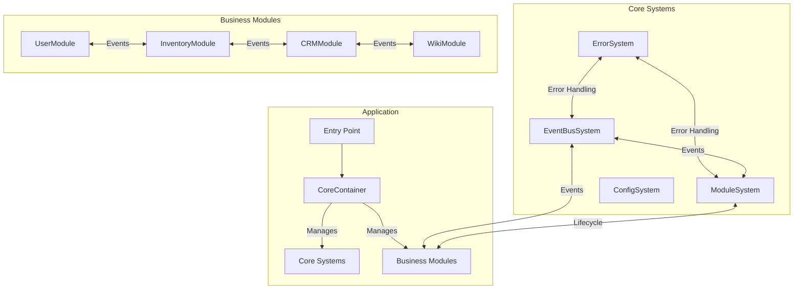

# TSMIS Developer Manual 
Version 2.2.0

## Table of Contents
1. [Getting Started](#1-getting-started)
2. [Development Stack](#2-development-stack)
3. [Architecture Overview](#3-architecture-overview) 
4. [Core Systems](#4-core-systems)
5. [Implementing a Business Module](#5-implementing-a-business-module)
6. [Using the Container for DI](#6-using-the-container-for-di)
7. [Error Handling](#7-error-handling)
8. [Event Publishing and Handling](#8-event-publishing-and-handling)
9. [Health Monitoring](#9-health-monitoring)
10. [Metrics Tracking](#10-metrics-tracking)
11. [Writing Tests](#11-writing-tests)
12. [Coding Guidelines](#12-coding-guidelines)
13. [Troubleshooting](#13-troubleshooting)
14. [Core Components Checklist](#14-core-components-checklist)

## 1. Getting Started

### Prerequisites
- Node.js >= 18.0.0
- PostgreSQL >= 14.0
- Redis >= 6.0

### Installation
```bash
# Clone the repository
git clone https://github.com/your-org/tsmis.git
cd tsmis

# Install dependencies
npm install

# Set up environment variables
cp .env.example .env
# Edit .env with your configuration

# Run development server
npm run dev
```

## 2. Development Stack
- **Runtime**: Node.js
- **API Framework**: Fastify 
- **Database**: PostgreSQL
- **Cache**: Redis
- **Frontend**: Marko.js
- **Build**: Vite

## 3. Architecture Overview
The system follows a hybrid modular architecture with a modular core and event-driven services. 



### Key Components
- **CoreContainer**: Manages dependency injection and component lifecycle
- **ErrorSystem**: Standardizes error handling across the system
- **EventBusSystem**: Enables inter-module communication via events
- **ModuleSystem**: Provides the base class for business modules
- **Business Modules**: Encapsulate domain-specific functionality

### Architectural Principles
1. **Modularity**: System is composed of loosely coupled modules
2. **Dependency Injection**: Components declare dependencies explicitly
3. **Event-Driven**: Communication happens through events
4. **Error Standardization**: Consistent error handling across the system
5. **Health Monitoring**: All components provide health status
6. **Metrics Tracking**: Performance metrics collection

## 4. Core Systems

The TSMIS architecture is built on four core systems:

### CoreContainer
The container system manages dependency injection and component lifecycle:
- Component registration
- Dependency resolution
- Lifecycle management
- Component discovery

### ErrorSystem
The error system standardizes error handling:
- Domain-specific error types
- Error serialization and formatting
- Framework integration for error handling
- Error context enrichment

### EventBusSystem
The event system enables module communication:
- Event emission and subscription
- Pattern-based event routing
- Event queuing and processing
- Event history tracking

### ModuleSystem
The module system provides the foundation for business modules:
- Module registration and resolution
- Lifecycle management
- Health monitoring
- Dependency resolution

## 5. Implementing a Business Module
Business modules should extend the CoreModule class:

```javascript
import { CoreModule } from '@core/module/Module';
import { ValidationError } from '@core/errors';

class HRModule extends CoreModule {
  static dependencies = ['errorSystem', 'eventBusSystem', 'config', 'database'];
  static version = '1.0.0';
  
  // Implement lifecycle methods
  async onConfigure() {
    // Configure module with settings from this.config
    this.employeeRoles = this.config.employeeRoles || ['admin', 'user'];
  }
  
  async setupEventHandlers() {
    // Set up event subscriptions
    const eventBus = this.deps.eventBusSystem.getEventBus();
    this.subscriptions = [
      eventBus.subscribe('employee.created', this.handleEmployeeCreated.bind(this)),
      eventBus.subscribe('employee.updated', this.handleEmployeeUpdated.bind(this))
    ];
  }
  
  async onSetupHealthChecks() {
    // Register health checks
    this.registerHealthCheck('database', async () => {
      const connected = await this.deps.database.checkConnection();
      return {
        status: connected ? 'healthy' : 'unhealthy',
        details: { connected }
      };
    });
  }
  
  async onInitialize() {
    // Initialize module resources
    await this.deps.database.ensureTable('employees');
  }
  
  async onShutdown() {
    // Clean up resources and subscriptions
    for (const subId of this.subscriptions) {
      this.eventBus.unsubscribe(subId);
    }
  }
  
  // Implement business logic
  async createEmployee(data) {
    try {
      // Validate data
      if (!data.name) {
        throw new ValidationError('MISSING_NAME', 'Employee name is required');
      }
      
      // Process operation
      const employee = await this.deps.database.insert('employees', data);
      
      // Emit event
      await this.emit('employee.created', employee);
      
      // Record metric
      this.recordMetric('employees.created', 1);
      
      return employee;
    } catch (error) {
      // Handle error with context
      await this.handleError(error, { method: 'createEmployee', data });
      throw error;
    }
  }
  
  // Event handlers
  async handleEmployeeCreated(event) {
    try {
      // Handle event
      console.log(`Employee created: ${event.data.name}`);
    } catch (error) {
      await this.handleError(error, { event, handler: 'handleEmployeeCreated' });
    }
  }
}

export default HRModule;
```

Register the module with the ModuleSystem:

```javascript
// In app.js or similar entry point
const moduleSystem = container.resolve('moduleSystem');
await moduleSystem.register('hrModule', HRModule, {
  employeeRoles: ['admin', 'manager', 'employee']
});
```

## 6. Using the Container for DI
The CoreContainer handles dependency injection. Inject dependencies in the module constructor:

```javascript
class HRModule extends CoreModule {
  static dependencies = ['database', 'auth', 'config'];
  
  constructor(deps) {
    super(deps);
    this.database = deps.database;
    this.auth = deps.auth;
    this.config = deps.config.hrModule || {};
  }
}
```

Resolve dependencies from the container:

```javascript
// In app.js or similar entry point
const container = new CoreContainer();

// Register components
container.register('errorSystem', createErrorSystem);
container.register('config', () => appConfig);
container.register('eventBusSystem', createEventBusSystem);
container.register('moduleSystem', createModuleSystem);
container.register('database', createDatabaseService);
container.register('hrModule', HRModule);

// Initialize container
await container.initialize();

// Resolve a module
const hrModule = await container.resolve('hrModule');
```

## 7. Error Handling
Use the ErrorSystem to create and handle errors:

### Error Types
Each domain/system has its own error type:
- `CoreError`: Base error class
- `AccessError`: Authorization errors (HTTP 403)
- `AuthError`: Authentication errors (HTTP 401)
- `ConfigError`: Configuration errors (HTTP 500)
- `ModuleError`: Module system errors (HTTP 500)
- `NetworkError`: Network-related errors (HTTP 503)
- `ServiceError`: Service-level errors (HTTP 503)
- `ValidationError`: Input validation errors (HTTP 400)
- `EventError`: Event system errors (HTTP 500)

### Creating Errors
```javascript
import { ValidationError, ErrorCodes } from '@core/errors';

// Create an error with code, message, and details
const error = new ValidationError(
  ErrorCodes.VALIDATION.INVALID_EMPLOYEE_ID,
  'Invalid employee ID',
  { providedId: id }
);
```

### Handling Errors
```javascript
try {
  // Operation that may throw
  await this.database.query('SELECT * FROM employees');
} catch (err) {
  // Handle with context
  await this.handleError(err, { 
    operation: 'getEmployees',
    query: 'SELECT * FROM employees'
  });
  
  // Decide whether to re-throw or return error response
  throw err;
}
```

### Error Context
Always provide context when handling errors:
```javascript
await this.handleError(error, {
  userId: user.id,
  operation: 'createUser',
  data: userData
});
```

## 8. Event Publishing and Handling
The EventBusSystem provides centralized event management:

### Publishing Events
```javascript
// From within a module
await this.emit('employee.created', { 
  id: employee.id,
  name: employee.name,
  department: employee.department
});

// Using eventBus directly
const eventBus = this.deps.eventBusSystem.getEventBus();
await eventBus.emit('employee.created', employeeData, {
  metadata: {
    source: 'hrModule',
    user: currentUser.id
  }
});
```

### Subscribing to Events
```javascript
// In the setupEventHandlers method
async setupEventHandlers() {
  const eventBus = this.deps.eventBusSystem.getEventBus();
  
  // Direct subscription
  this.subscriptions = [
    eventBus.subscribe('employee.created', this.handleEmployeeCreated.bind(this)),
    
    // Pattern subscription (all employee events)
    eventBus.subscribe('employee.*', this.handleEmployeeEvents.bind(this)),
    
    // Wildcard subscription (all events)
    eventBus.subscribe('*', this.logAllEvents.bind(this))
  ];
}
```

### Event Handlers
```javascript
async handleEmployeeCreated(event) {
  try {
    // Extract data from event
    const employee = event.data;
    
    // Process event
    await this.notifyDepartment(employee);
    
    // Record metric
    this.recordMetric('notifications.sent', 1, {
      type: 'employeeCreated',
      department: employee.department
    });
  } catch (error) {
    // Handle error with context
    await this.handleError(error, {
      event,
      handler: 'handleEmployeeCreated'
    });
  }
}
```

### Cleaning Up Subscriptions
```javascript
async onShutdown() {
  // Clean up subscriptions
  if (this.eventBus) {
    for (const subId of this.subscriptions) {
      this.eventBus.unsubscribe(subId);
    }
  }
  this.subscriptions = [];
}
```

## 9. Health Monitoring
Modules should provide health checks for their services:

### Registering Health Checks
```javascript
async onSetupHealthChecks() {
  // Database connection check
  this.registerHealthCheck('database', async () => {
    const connected = await this.database.checkConnection();
    return {
      status: connected ? 'healthy' : 'unhealthy',
      details: { connected }
    };
  });
  
  // Cache health check
  this.registerHealthCheck('cache', async () => {
    return {
      status: 'healthy',
      size: this.cache.size,
      hitRate: this.cache.stats.hitRate
    };
  });
}
```

### Health Check Results
Health checks should return a standardized result:
```javascript
{
  status: 'healthy', // or 'unhealthy', 'error'
  details: { /* optional details */ }
}
```

### System Health Check
```javascript
// Get health status of the whole system
const moduleSystem = container.resolve('moduleSystem');
const systemHealth = await moduleSystem.getSystemHealth();

console.log(systemHealth);
// {
//   status: 'healthy',
//   timestamp: '2024-03-28T15:30:45.123Z',
//   modules: {
//     'hrModule': { status: 'healthy', ... },
//     'userModule': { status: 'healthy', ... }
//   }
// }
```

## 10. Metrics Tracking
Modules should record metrics for important operations:

### Recording Metrics
```javascript
// Record a metric with tags
this.recordMetric('employees.created', 1, {
  department: employee.department,
  role: employee.role
});

// Record timing metric
const startTime = Date.now();
await this.processReports();
const duration = Date.now() - startTime;
this.recordMetric('reports.processing.time', duration);
```

### Getting Metrics
```javascript
// Get metrics from a module
const metrics = hrModule.state.metrics;

// Or from the EventBusSystem
const eventBusSystem = container.resolve('eventBusSystem');
const eventMetrics = eventBusSystem.getMetrics();
```

## 11. Writing Tests
Write unit tests for modules using Jest:

### Module Testing
```javascript
describe('HRModule', () => {
  let hrModule;
  let mockDatabase;
  let mockEventBus;
  
  beforeEach(async () => {
    // Create mocks
    mockDatabase = {
      insert: jest.fn().mockResolvedValue({ id: '123', name: 'Test Employee' }),
      checkConnection: jest.fn().mockResolvedValue(true)
    };
    
    mockEventBus = {
      emit: jest.fn(),
      subscribe: jest.fn().mockReturnValue('sub-id'),
      unsubscribe: jest.fn()
    };
    
    const mockEventBusSystem = {
      getEventBus: () => mockEventBus
    };
    
    // Create module with mocked dependencies
    hrModule = new HRModule({
      database: mockDatabase,
      eventBusSystem: mockEventBusSystem,
      errorSystem: { handleError: jest.fn() },
      config: { employeeRoles: ['admin', 'user'] }
    });
    
    // Initialize module
    await hrModule.initialize();
  });
  
  afterEach(async () => {
    // Clean up
    await hrModule.shutdown();
  });
  
  test('should create employee', async () => {
    const employeeData = { name: 'John Doe', department: 'IT' };
    const result = await hrModule.createEmployee(employeeData);
    
    // Verify database was called
    expect(mockDatabase.insert).toHaveBeenCalledWith('employees', employeeData);
    
    // Verify event was emitted
    expect(mockEventBus.emit).toHaveBeenCalledWith('employee.created', expect.objectContaining({
      id: '123',
      name: 'Test Employee'
    }));
    
    // Verify result
    expect(result).toEqual({ id: '123', name: 'Test Employee' });
  });
  
  test('should handle validation error', async () => {
    // Call with invalid data
    await expect(hrModule.createEmployee({}))
      .rejects
      .toThrow('Employee name is required');
    
    // Verify database was not called
    expect(mockDatabase.insert).not.toHaveBeenCalled();
  });
});
```

### Integration Testing
```javascript
describe('HRModule Integration', () => {
  let container;
  let hrModule;
  
  beforeAll(async () => {
    // Create container with real dependencies
    container = new CoreContainer();
    
    // Register components
    container.register('errorSystem', createErrorSystem);
    container.register('config', () => testConfig);
    container.register('eventBusSystem', createEventBusSystem);
    container.register('moduleSystem', createModuleSystem);
    container.register('database', createTestDatabase);
    container.register('hrModule', HRModule);
    
    // Initialize container
    await container.initialize();
    
    // Resolve module
    hrModule = await container.resolve('hrModule');
  });
  
  afterAll(async () => {
    await container.shutdown();
  });
  
  test('should create and retrieve employee', async () => {
    // Create employee
    const employee = await hrModule.createEmployee({
      name: 'Jane Smith',
      department: 'HR'
    });
    
    // Retrieve employee
    const retrieved = await hrModule.getEmployee(employee.id);
    
    expect(retrieved).toEqual(employee);
  });
});
```

## 12. Coding Guidelines

### Naming Conventions
- **Files**: camelCase for regular files, PascalCase for classes (e.g., `UserModule.js`)
- **Classes**: PascalCase (e.g., `UserService`, `CoreModule`)
- **Methods/Functions**: camelCase (e.g., `createUser`, `handleError`)
- **Variables**: camelCase (e.g., `userData`, `configOptions`)
- **Constants**: UPPER_SNAKE_CASE (e.g., `MAX_RETRY_COUNT`)

### Structure Guidelines
- Group related code in modules
- Keep files focused on a single responsibility
- Use descriptive names for functions and variables
- Document public methods and interfaces
- Handle errors properly with context
- Use async/await consistently (not mixing with callbacks or promises)
- Add appropriate error handling for async operations

### Error Handling Conventions
- Use specialized error types from ErrorSystem
- Always provide context with errors
- Log errors with appropriate severity levels
- Handle expected error cases gracefully
- Never swallow errors silently

### Event Naming Conventions
- Use domain-driven naming: `domain.event`
- Past tense for state changes: `user.created`, `order.completed`
- Present tense for commands: `notification.send`
- Include version for breaking changes: `user.created.v2`

## 13. Troubleshooting

### Common Issues

#### Module Initialization Errors
- Check dependency declarations in `static dependencies`
- Verify all dependencies are registered in the container
- Ensure proper error handling in lifecycle methods

#### Event Handling Issues
- Verify event names match exactly (they're case-sensitive)
- Check that event handlers are properly bound (`this.handler.bind(this)`)
- Ensure event subscriptions are set up during initialization

#### Container Resolution Errors
- Ensure components are registered before resolving
- Check for circular dependencies
- Verify component names match exactly

### Debugging Techniques

#### Container Debugging
```javascript
// Check container state
console.log('Registered components:', Array.from(container.components.keys()));
console.log('Initialized components:', Array.from(container.instances.keys()));
```

#### Event System Debugging
```javascript
// Debug events by adding a wildcard listener
eventBus.subscribe('*', (event) => {
  console.log(`EVENT: ${event.name}`, event.data);
});
```

#### Module System Debugging
```javascript
// Check module system health
const health = await moduleSystem.getSystemHealth();
console.log('System health:', JSON.stringify(health, null, 2));
```

#### Error System Debugging
```javascript
// Register custom error handler for debugging
errorSystem.registerHandler('*', (error, context) => {
  console.error('ERROR:', error.code, error.message);
  console.error('CONTEXT:', JSON.stringify(context));
  console.error('STACK:', error.stack);
});
```

## 14. Core Components Checklist

When implementing a new core component, ensure you complete the following:

### 1. Base Structure
- [ ] Define appropriate class name and structure
- [ ] Declare static `dependencies` property
- [ ] Declare static `version` property
- [ ] Implement constructor with dependency validation
- [ ] Set up initial state object

### 2. Lifecycle Methods
- [ ] Implement `initialize()` method
- [ ] Implement `shutdown()` method 
- [ ] Add proper error handling for lifecycle methods
- [ ] Emit lifecycle events

### 3. Error Handling
- [ ] Create specialized error type in ErrorSystem 
- [ ] Define error codes for the component
- [ ] Implement `handleError()` method
- [ ] Track errors in state

### 4. Event Integration
- [ ] Properly integrate with EventBusSystem if needed
- [ ] Use consistent event naming patterns
- [ ] Implement proper event subscription cleanup

### 5. State Management
- [ ] Define comprehensive state object
- [ ] Update state during lifecycle changes
- [ ] Track component metrics

### 6. Health Monitoring
- [ ] Implement `checkHealth()` method
- [ ] Add default health checks
- [ ] Support custom health check registration

### 7. Testing
- [ ] Write unit tests for all public methods
- [ ] Test error handling paths
- [ ] Test lifecycle methods
- [ ] Test integration with other core systems

### 8. Documentation
- [ ] Create comprehensive documentation in docs/
- [ ] Document public API methods
- [ ] Add architecture diagrams
- [ ] Document error codes and health checks
- [ ] Include troubleshooting section

### 9. Factory Function
- [ ] Create factory function for container registration
- [ ] Support default dependencies in factory
- [ ] Ensure factory is properly exported

### 10. Integration
- [ ] Register in container with correct dependencies
- [ ] Ensure correct initialization order
- [ ] Test integration with other core systems