# Toro_SM Information System - Technical Documentation
Version 2.0.0

## Table of Contents
1. [System Overview](#1-system-overview)
2. [System Architecture](#2-system-architecture) 
3. [Core Components](#3-core-components)
   - [Container System](#31-container-system)
   - [Error System](#32-error-system)
   - [Event System](#33-event-system)
   - [Module System](#34-module-system)
4. [Component Interactions](#4-component-interactions)
5. [Lifecycle Management](#5-lifecycle-management)
6. [Error Handling](#6-error-handling)
7. [Event-Driven Communication](#7-event-driven-communication)
8. [Health Monitoring](#8-health-monitoring)
9. [Metrics Tracking](#9-metrics-tracking)
10. [API Layer](#10-api-layer)
11. [Security](#11-security)
12. [Development & Deployment](#12-development--deployment)
13. [Directory Structure](#13-directory-structure)

## 1. System Overview

Toro_SM is an enterprise information system built on a hybrid modular architecture. It combines a modular core with event-driven services to provide various business functionalities. The system is designed to be:

- **Modular**: Built from independent, loosely coupled components
- **Extensible**: Easy to add new functionality through modules
- **Maintainable**: Clear separation of concerns and standardized patterns
- **Testable**: Components can be tested in isolation
- **Resilient**: Comprehensive error handling and health monitoring

### Key Technologies

- **Node.js**: Server-side JavaScript runtime
- **Fastify**: High-performance web framework
- **PostgreSQL**: Relational database for persistent storage
- **Redis**: In-memory data store for caching
- **Marko.js**: Server-side rendering framework
- **Vite**: Build tool for frontend assets

## 2. System Architecture

The system follows a layered architecture with clear separation of concerns:

```mermaid
graph TB
    subgraph "Frontend Layer"
        UI[Marko UI Components]
        SSR[Server-Side Rendering]
    end
    
    subgraph "Core Layer"
        API[API Gateway/Fastify]
        
        subgraph "Core Systems"
            CONT[Container System]
            ERR[Error System]
            EVT[Event System]
            MOD[Module System]
        end
    end
    
    subgraph "Module Layer"
        ACC[Accounting]
        HR[HR System] 
        INV[Inventory]
        CRM[CRM]
        WIKI[Wiki]
        DOC[Documentation]
        PM[Project Mgmt]
    end
    
    subgraph "Service Layer"
        DB[Database Service]
        CACHE[Cache Service]
        LOG[Logging Service]
        AUTH[Auth Service]
        FILE[File Service]
    end
    
    subgraph "Data Layer"
        PSQL[(PostgreSQL)]
        REDIS[(Redis)]
        FS[(File Storage)]
    end

    UI --> SSR
    SSR --> API
    
    API --> CONT
    
    CONT --> ERR
    CONT --> EVT
    CONT --> MOD
    
    MOD --> |Manages| Module Layer
    EVT <--> |Events| Module Layer
    
    Module Layer --> Service Layer
    Service Layer --> Data Layer
    
    ERR <--> API
    ERR <--> Module Layer
    ERR <--> Service Layer
```

### Component Interaction Flow

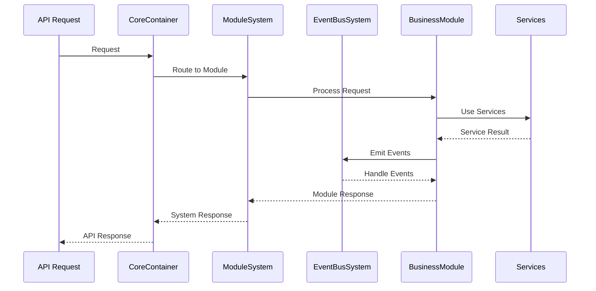

## 3. Core Components

The system is built around four core components:

### 3.1 Container System

The Container System is responsible for dependency injection and lifecycle management:

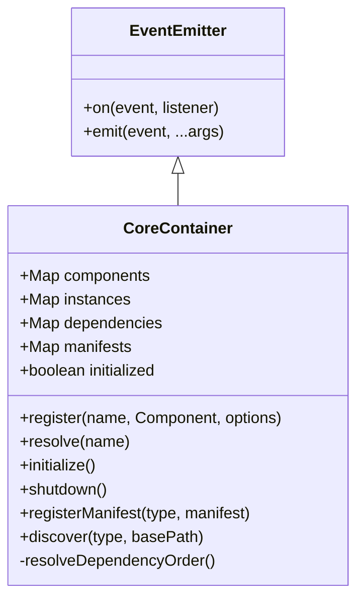

#### Key Features:
- Component registration and resolution
- Dependency tracking and injection
- Topological sorting for initialization order
- Component discovery
- Lifecycle management

#### Container Events:
- `component:registered`: When a component is registered
- `component:resolved`: When a component is resolved
- `initialized`: When the container is initialized
- `shutdown`: When the container is shut down
- `discovery:error`: When component discovery encounters an error
- `discovery:completed`: When component discovery is completed

### 3.2 Error System

The Error System provides standardized error handling:

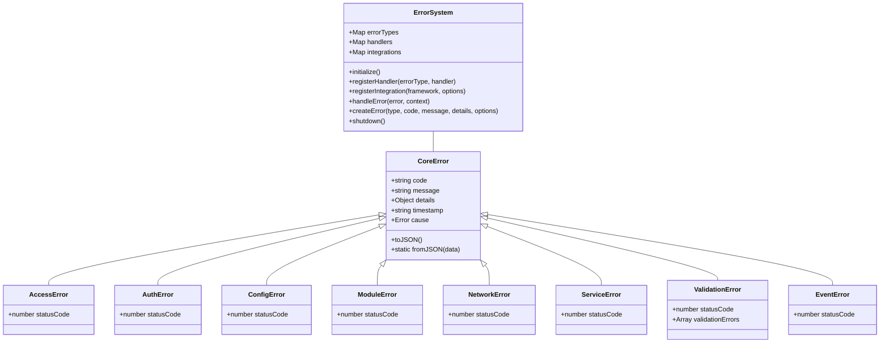

#### Key Features:
- Standardized error types per domain
- Error context enrichment
- Framework-specific error handling
- Error serialization for APIs
- Error handling registry

#### Error Types:
- `CoreError`: Base error class
- `AccessError`: Authorization errors (403)
- `AuthError`: Authentication errors (401)
- `ConfigError`: Configuration errors (500)
- `ModuleError`: Module system errors (500)
- `NetworkError`: Network-related errors (503)
- `ServiceError`: Service-level errors (503)
- `ValidationError`: Input validation errors (400)
- `EventError`: Event system errors (500)

### 3.3 Event System

The Event System facilitates communication between modules:

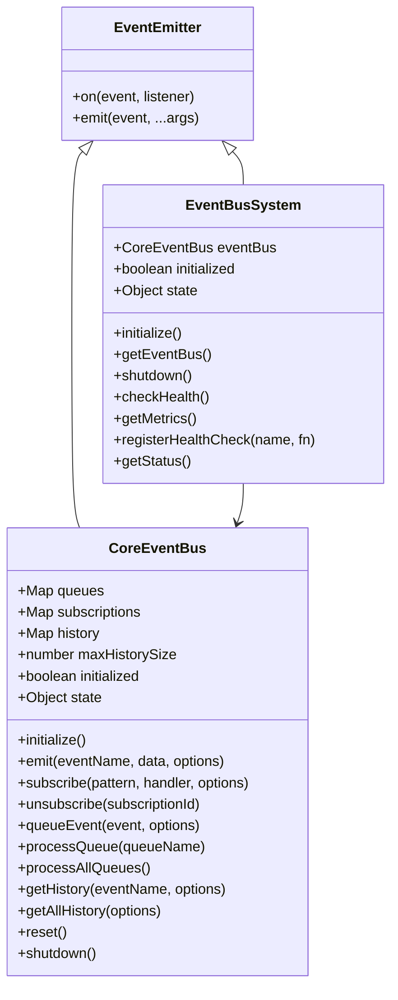

#### Key Features:
- Event emission and subscription
- Pattern-based event routing
- Event queuing for delayed processing
- Event history tracking
- Metrics collection
- Health monitoring

#### Event Types:
- **Direct Events**: Exact event name matching
- **Wildcard Events**: Match all events using `*`
- **Pattern Events**: Pattern matching like `user.*` or `*.created`

#### Event Structure:
```javascript
{
  id: 'unique-id',
  name: 'event.name',
  data: { /* event payload */ },
  timestamp: '2024-03-27T12:34:56.789Z',
  metadata: { /* additional metadata */ }
}
```

### 3.4 Module System

The Module System manages business modules:

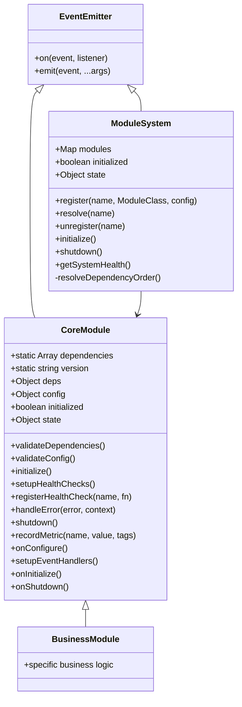

#### Key Features:
- Module registration and resolution
- Module lifecycle management
- Health monitoring
- Dependency resolution
- State tracking
- Metrics collection

#### Module Lifecycle:
- **Created**: Initial state after construction
- **Configuring**: During onConfigure phase
- **Setting Up**: During setupEventHandlers and setupHealthChecks
- **Initializing**: During onInitialize phase
- **Running**: Active and operational
- **Shutting Down**: During onShutdown phase
- **Shutdown**: Inactive

## 4. Component Interactions

### Dependency Injection Flow

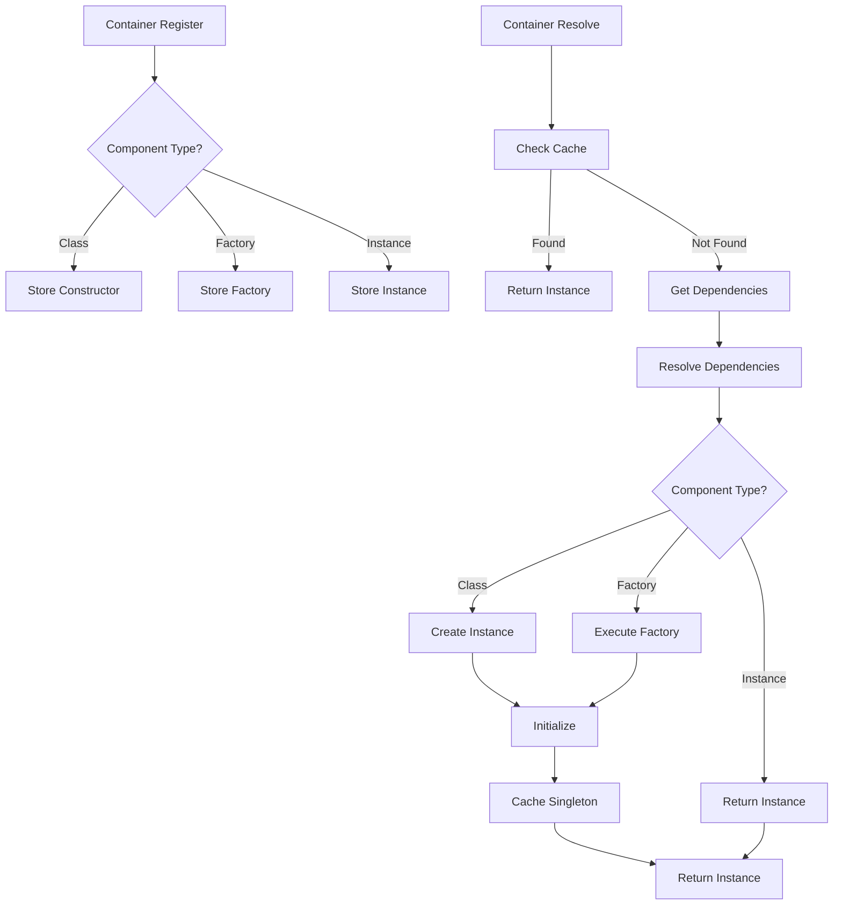

### Error Handling Flow

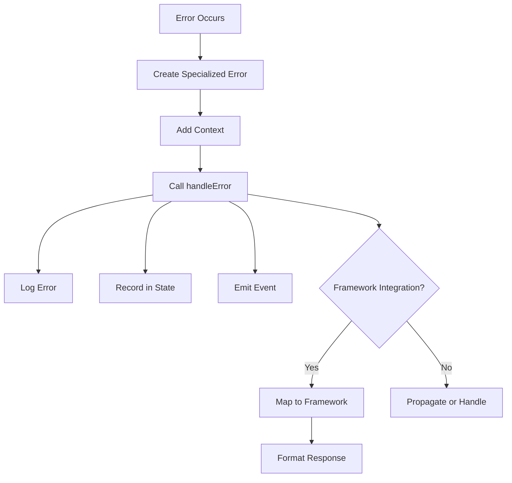

### Event Flow

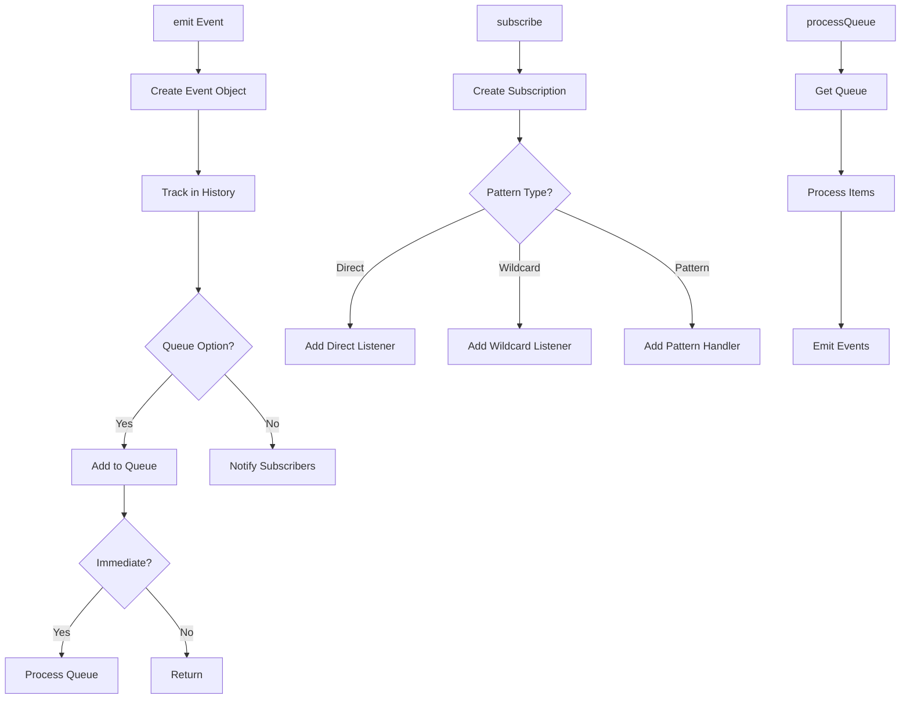

## 5. Lifecycle Management

The system implements a consistent lifecycle across all components:

### Container Lifecycle

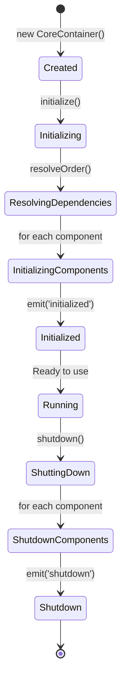

### Module Lifecycle

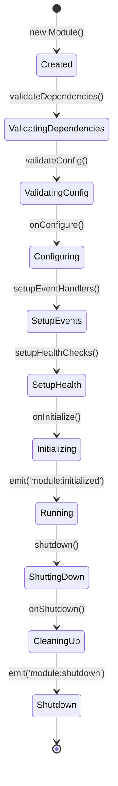

### Event Bus Lifecycle

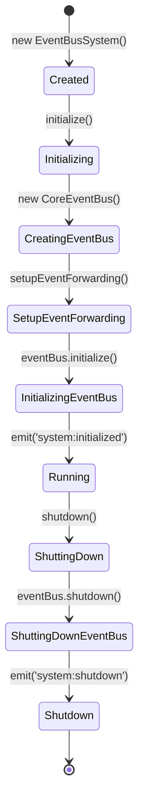

## 6. Error Handling

The Error System provides standardized error handling across the application:

### Error Creation

```javascript
// Creating typed errors
const validationError = new ValidationError(
  ErrorCodes.VALIDATION.INVALID_INPUT,
  'Email format is invalid',
  { 
    validationErrors: [
      { field: 'email', message: 'Invalid email format' }
    ]
  }
);

// Using ErrorSystem factory
const error = errorSystem.createError(
  'ValidationError',
  ErrorCodes.VALIDATION.INVALID_INPUT,
  'Email format is invalid',
  { field: 'email', value: 'invalid' }
);
```

### Error Handling

```javascript
// Module error handling
async handleError(error, context = {}) {
  // Add to state
  this.state.errors.push({
    timestamp: new Date().toISOString(),
    error: error.message,
    context
  });
  
  // Forward to error system
  if (this.deps.errorSystem) {
    await this.deps.errorSystem.handleError(error, {
      module: this.constructor.name,
      ...context
    });
  }
  
  // Emit error event
  await this.emit('module:error', {
    module: this.constructor.name,
    error,
    context
  });
}

// Using in business logic
try {
  await this.database.query('SELECT * FROM users');
} catch (error) {
  await this.handleError(error, {
    operation: 'getUsers',
    query: 'SELECT * FROM users'
  });
  throw error;
}
```

### Error Integration with Frameworks

```javascript
// Fastify integration
fastify.setErrorHandler(async (error, request, reply) => {
  const context = {
    requestId: request.id,
    url: request.url,
    method: request.method
  };

  // Map to core error
  const mappedError = fastifyIntegration.mapError(error);
  
  // Handle with error system
  await errorSystem.handleError(mappedError, context);
  
  // Serialize for response
  const serialized = fastifyIntegration.serializeError(mappedError, context);
  
  // Send response
  reply.status(mappedError.statusCode || 500).send(serialized);
});
```

## 7. Event-Driven Communication

The Event System facilitates communication between modules:

### Event Publication

```javascript
// Basic event emission
await eventBus.emit('user.created', {
  id: 'user-123',
  name: 'John Doe',
  email: 'john@example.com'
});

// Event with metadata
await eventBus.emit('order.completed', orderData, {
  metadata: {
    source: 'orderModule',
    user: currentUser.id,
    ip: request.ip
  }
});

// Queued event for delayed processing
await eventBus.emit('report.generate', reportData, {
  queue: true
});

// Process queue when appropriate
await eventBus.processQueue('report.generate');
```

### Event Subscription

```javascript
// Direct subscription
const subId = eventBus.subscribe('user.created', handleUserCreated);

// Pattern-based subscription
eventBus.subscribe('user.*', handleUserEvents);
eventBus.subscribe('*.created', handleCreationEvents);

// Wildcard subscription
eventBus.subscribe('*', logAllEvents);

// Unsubscribe when done
eventBus.unsubscribe(subId);
```

### Event Patterns

The system supports various event naming patterns:

- **Domain Events**: `domain.event` (e.g., `user.created`)
- **State Changes**: Past tense for completed actions (e.g., `order.completed`)
- **Commands**: Present tense for requested actions (e.g., `email.send`)
- **Versioned Events**: Include version for breaking changes (e.g., `user.created.v2`)
- **System Events**: Prefixed with `system:` (e.g., `system:initialized`)

## 8. Health Monitoring

The system provides comprehensive health monitoring:

### Health Check Registration

```javascript
// Register health check in a module
this.registerHealthCheck('database', async () => {
  const connected = await this.database.checkConnection();
  return {
    status: connected ? 'healthy' : 'unhealthy',
    details: { connected }
  };
});

// Register health check in EventBusSystem
eventBusSystem.registerHealthCheck('queues', async () => {
  const queueSizes = {};
  for (const [name, queue] of eventBus.queues.entries()) {
    queueSizes[name] = queue.length;
  }
  
  return {
    status: 'healthy',
    queueCount: eventBus.queues.size,
    queues: queueSizes
  };
});
```

### Health Check Output

```javascript
// Result format
{
  name: 'UserModule',
  version: '1.0.0',
  status: 'healthy', // or 'unhealthy', 'error'
  timestamp: '2024-03-27T12:34:56.789Z',
  checks: {
    database: {
      status: 'healthy',
      details: { connected: true }
    },
    cache: {
      status: 'healthy',
      size: 256,
      hitRate: 0.93
    }
  }
}
```

### System Health Check

```javascript
// Get overall system health
const moduleSystem = container.resolve('moduleSystem');
const systemHealth = await moduleSystem.getSystemHealth();

// Result format
{
  status: 'healthy', // or 'degraded', 'unhealthy'
  timestamp: '2024-03-27T12:34:56.789Z',
  uptime: 3600000, // ms
  modules: {
    'userModule': {
      status: 'healthy',
      // module health details
    },
    'orderModule': {
      status: 'healthy',
      // module health details
    }
  },
  errorCount: 0
}
```

## 9. Metrics Tracking

The system collects metrics for monitoring and performance analysis:

### Recording Metrics

```javascript
// Record a simple metric
this.recordMetric('users.created', 1);

// Record a metric with tags
this.recordMetric('orders.completed', 1, {
  userId: order.userId,
  amount: order.total,
  paymentMethod: order.paymentMethod
});

// Record a timing metric
const startTime = Date.now();
await this.processReport();
const duration = Date.now() - startTime;
this.recordMetric('report.processing.time', duration, {
  reportType: report.type,
  size: report.size
});
```

### Metrics Format

```javascript
{
  name: 'metric.name',
  value: 1,
  timestamp: 1679925851000,
  tags: {
    tag1: 'value1',
    tag2: 'value2'
  }
}
```

### Getting Metrics

```javascript
// Get module metrics
const metrics = userModule.state.metrics;

// Get EventBusSystem metrics
const eventBusSystem = container.resolve('eventBusSystem');
const eventMetrics = eventBusSystem.getMetrics();
```

## 10. API Layer

The API layer is implemented using Fastify and integrates with the core systems:

### API Integration

```javascript
// Create Fastify instance
const fastify = Fastify({
  logger: {
    level: process.env.LOG_LEVEL || 'info',
    serializers: {
      error: (error) => errorSystem.serializeError(error)
    }
  }
});

// Setup error handling
setupErrorHandler(fastify);

// Route to module
fastify.post('/api/users', async (request, reply) => {
  const userModule = await moduleSystem.resolve('userModule');
  const user = await userModule.createUser(request.body);
  return user;
});
```

### API Error Handling

```javascript
try {
  const user = await userModule.createUser(request.body);
  return user;
} catch (error) {
  // Error is automatically handled by Fastify error handler
  // which integrates with the ErrorSystem
  throw error;
}
```

## 11. Security

### Authentication

The system uses JWT-based authentication:

```javascript
// Set up JWT
fastify.register(require('@fastify/jwt'), {
  secret: process.env.JWT_SECRET
});

// Authentication decorator
fastify.decorate('authenticate', async (request, reply) => {
  try {
    await request.jwtVerify();
  } catch (err) {
    throw new AuthError(
      ErrorCodes.AUTH.INVALID_TOKEN,
      'Invalid authentication token',
      { originalError: err.message }
    );
  }
});

// Protected route
fastify.get('/api/protected',
  { onRequest: [fastify.authenticate] },
  async (request, reply) => {
    return { user: request.user };
  }
);
```

### Authorization

```javascript
// Access control
class AccessControl {
  static dependencies = ['userModule'];
  
  constructor(deps) {
    this.userModule = deps.userModule;
  }
  
  async checkAccess(userId, resource, action) {
    const user = await this.userModule.getUser(userId);
    const permissions = await this.userModule.getUserPermissions(userId);
    
    if (!permissions.includes(`${resource}:${action}`)) {
      throw new AccessError(
        ErrorCodes.ACCESS.INSUFFICIENT_RIGHTS,
        `User does not have permission to ${action} ${resource}`,
        { userId, resource, action, permissions }
      );
    }
    
    return true;
  }
}

// Using in routes
fastify.post('/api/resources/:id',
  { onRequest: [fastify.authenticate] },
  async (request, reply) => {
    const accessControl = container.resolve('accessControl');
    await accessControl.checkAccess(
      request.user.id,
      'resource',
      'update'
    );
    
    // Proceed with authorized action
    // ...
  }
);
```

## 12. Development & Deployment

### Development Workflow

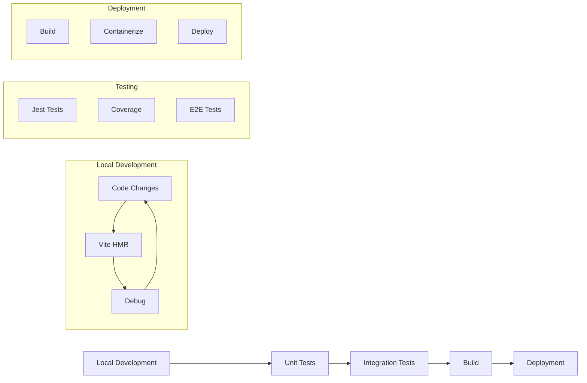

### Local Development

```bash
# Start development server with hot reload
npm run dev

# Start with debugging
npm run dev:inspect
```

### Testing

```bash
# Run all tests
npm test

# Run specific test file
npm test tests/core/event/EventBus.test.js

# Run tests with coverage
npm run test:coverage
```

### Building

```bash
# Build for production
npm run build

# Build server
npm run build:server

# Build client
npm run build:client
```

### Deployment

```bash
# Start production server
NODE_ENV=production npm start
```

## 13. Directory Structure

```
tsmis/
├── src/
│   ├── app.js                # Application entry point
│   ├── config/               # Configuration files
│   ├── core/                 # Core systems
│   │   ├── container/        # Container system
│   │   ├── errors/           # Error system
│   │   │   ├── types/        # Error types
│   │   │   └── integrations/ # Framework integrations
│   │   ├── event/            # Event system
│   │   └── module/           # Module system
│   ├── modules/              # Business modules
│   │   ├── user/             # User module
│   │   ├── inventory/        # Inventory module
│   │   └── ...               # Other modules
│   └── services/             # Shared services
│       ├── cache/            # Cache service
│       ├── database/         # Database service
│       ├── email/            # Email service
│       ├── logger/           # Logging service
│       └── ...               # Other services
├── tests/                    # Test files
│   ├── core/                 # Core system tests
│   ├── modules/              # Module tests
│   └── services/             # Service tests
├── docs/                     # Documentation
│   ├── dev_manual.md         # Developer manual
│   ├── technical.md          # Technical documentation
│   └── ...                   # Other docs
├── public/                   # Static assets
├── server.js                 # Server entry point
├── vite.config.js            # Vite configuration
└── package.json              # Package manifest
```