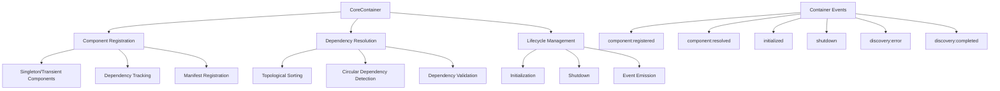

# CoreContainer System Documentation

## Table of Contents
1. [Overview](#overview)
2. [Purpose](#purpose)
3. [System Architecture](#system-architecture)
4. [Core Concepts](#core-concepts)
5. [Component Registration](#component-registration)
6. [Dependency Resolution](#dependency-resolution)
7. [Lifecycle Management](#lifecycle-management)
8. [Event System Integration](#event-system-integration)
9. [Component Discovery](#component-discovery)
10. [Container Usage](#container-usage)
11. [Advanced Features](#advanced-features)
12. [Error Handling](#error-handling)
13. [Testing Strategy](#testing-strategy)
14. [Best Practices](#best-practices)
15. [Extending the System](#extending-the-system)
16. [Areas for Improvement](#areas-for-improvement)

## Overview

The CoreContainer System is a sophisticated Dependency Injection (DI) and Inversion of Control (IoC) container designed to manage component lifecycles, dependencies, and system initialization. It is responsible for managing the lifecycle and dependencies of the core systems and components in the application, including the ErrorSystem, EventBusSystem, ModuleSystem, and other registered components.

## Purpose

The primary goals of the CoreContainer System are to:
- Manage component dependencies
- Facilitate loose coupling between system components
- Automate component initialization and shutdown
- Provide a centralized component registry
- Support complex dependency graphs
- Enable predictable initialization ordering
- Facilitate testability through dependency injection

## System Architecture

### Core Components

1. **CoreContainer** (`src/core/container/Container.js`)
   - Central component management system
   - Handles component registration
   - Manages dependency resolution
   - Controls component lifecycle
   - Emits lifecycle events
   - Supports component manifests

### Architecture Diagram



## Core Concepts

### Component Registration

- Components can be registered with optional configuration
- Supports singleton and transient component modes
- Tracks component dependencies
- Supports class, factory function, and instance registration

```javascript
// Class registration (singleton by default)
container.register('logger', LoggerService);

// Factory function registration
container.register('database', (deps) => {
  return createDatabaseService(deps);
});

// Direct instance registration
const configInstance = { apiKey: 'abc123' };
container.register('config', configInstance);
```

### Dependency Resolution

- Automatically resolves and injects dependencies
- Supports complex dependency graphs
- Prevents circular dependencies
- Ensures correct initialization order
- Caches singleton instances

```javascript
class AuthService {
  static dependencies = ['database', 'logger', 'config'];
  
  constructor(deps) {
    this.database = deps.database;
    this.logger = deps.logger;
    this.config = deps.config;
  }
}

container.register('auth', AuthService);
const authService = await container.resolve('auth');
```

### Lifecycle Management

- Provides `initialize()` and `shutdown()` methods
- Supports component-specific initialization logic
- Ensures proper initialization order based on dependencies
- Graceful shutdown with error handling
- Event emission for lifecycle events

```javascript
// Initialize all components in dependency order
await container.initialize();

// Graceful shutdown in reverse dependency order
await container.shutdown();
```

### Manifest Registration

- Supports component manifest registration
- Defines structure and requirements for component types
- Enables dynamic component discovery

```javascript
container.registerManifest('service', {
  configSchema: {
    /* JSON schema for service configuration */
  }
});
```

## Component Registration

The `CoreContainer.register` method is used to register components with the container:

```javascript
register(name, Component, options = {}) {
  if (this.components.has(name)) {
    throw new ConfigError(
      'DUPLICATE_COMPONENT',
      `Component ${name} is already registered`
    );
  }

  // Store component definition
  this.components.set(name, {
    Component,
    options: {
      singleton: true,
      ...options
    }
  });

  // Store dependencies
  this.dependencies.set(name, Component.dependencies || []);

  this.emit('component:registered', { name, Component });
  return this;
}
```

Components can be registered in several ways:

```javascript
// 1. Class constructor
class LoggerService {
  static dependencies = ['config'];
  constructor(deps) {
    this.config = deps.config;
  }
}
container.register('logger', LoggerService);

// 2. Factory function
const createDatabaseService = (deps) => {
  return {
    query: async () => { /* ... */ }
  };
};
container.register('database', createDatabaseService);

// 3. Direct instance (singleton)
const configValues = {
  apiUrl: 'https://api.example.com',
  timeout: 5000
};
container.register('config', configValues);
```

## Dependency Resolution

The `CoreContainer.resolve` method resolves a component and its dependencies:

```javascript
async resolve(name) {
  if (!this.components.has(name)) {
    throw new ServiceError(
      'UNKNOWN_COMPONENT',
      `Component ${name} is not registered`
    );
  }

  const { Component, options } = this.components.get(name);

  // Return existing instance for singletons
  if (options.singleton && this.instances.has(name)) {
    return this.instances.get(name);
  }

  // Resolve dependencies first
  const deps = this.dependencies.get(name) || [];
  const resolvedDeps = {};

  for (const dep of deps) {
    resolvedDeps[dep] = await this.resolve(dep);
  }

  // Handle different component types
  let instance;
  if (typeof Component === 'function') {
    if (Component.prototype) {
      // Class constructor
      instance = new Component(resolvedDeps);
    } else {
      // Factory function - handle both sync and async
      instance = await Promise.resolve(Component(resolvedDeps));
    }
  } else {
    instance = Component;
  }

  // Initialize if container is initialized
  if (this.initialized && typeof instance.initialize === 'function') {
    await instance.initialize();
  }

  // Cache singleton instance
  if (options.singleton) {
    this.instances.set(name, instance);
  }

  this.emit('component:resolved', { name, instance });
  return instance;
}
```

## Lifecycle Management

### Initialization Process

The `CoreContainer.initialize` method initializes all registered components in the correct dependency order:

```javascript
async initialize() {
  if (this.initialized) {
    throw new ServiceError(
      'ALREADY_INITIALIZED',
      'Container is already initialized'
    );
  }
  
  const order = this.resolveDependencyOrder();

  for (const name of order) {
    const instance = await this.resolve(name);
    if (typeof instance.initialize === 'function') {
      await instance.initialize();
    }
  }

  this.initialized = true;
  this.emit('initialized');
}
```

### Shutdown Process

The `CoreContainer.shutdown` method shuts down all initialized components in the reverse dependency order:

```javascript
async shutdown() {
  // Shutdown in reverse dependency order
  const order = this.resolveDependencyOrder().reverse();

  for (const name of order) {
    const instance = this.instances.get(name);
    if (instance && typeof instance.shutdown === 'function') {
      try {
        await instance.shutdown();
      } catch (error) {
        // Log error but continue shutdown process
        this.emit('shutdown:error', { 
          component: name, 
          error 
        });
      }
    }
  }

  this.instances.clear();
  this.initialized = false;
  this.emit('shutdown');
}
```

### Dependency Ordering

The `resolveDependencyOrder` method ensures components are initialized in the correct order:

```javascript
resolveDependencyOrder() {
  const visited = new Set();
  const visiting = new Set();
  const order = [];

  const visit = (name) => {
    if (visited.has(name)) return;
    if (visiting.has(name)) {
      throw new ConfigError(
        'CIRCULAR_DEPENDENCY',
        `Circular dependency detected: ${name}`
      );
    }

    visiting.add(name);
    
    const deps = this.dependencies.get(name) || [];
    
    for (const dep of deps) {
      if (!this.components.has(dep)) {
        throw new ConfigError(
          'MISSING_DEPENDENCY',
          `Dependency ${dep} required by ${name} is not registered`
        );
      }
      visit(dep);
    }
    
    visiting.delete(name);
    visited.add(name);
    order.push(name);
  };

  // Ensure core systems are initialized first
  const initOrder = [
    'errorSystem',
    'config',
    'eventBusSystem',
    'moduleSystem'
  ];

  for (const name of initOrder) {
    if (this.components.has(name)) {
      visit(name);
    }
  }

  // Then handle any remaining components
  for (const name of this.components.keys()) {
    if (!order.includes(name)) {
      visit(name);
    }
  }

  return order;
}
```

## Event System Integration

The CoreContainer integrates with the event system by emitting events at key lifecycle points:

```javascript
// Component registration
this.emit('component:registered', { name, Component });

// Component resolution
this.emit('component:resolved', { name, instance });

// Container initialization
this.emit('initialized');

// Container shutdown
this.emit('shutdown');

// Component discovery
this.emit('discovery:error', { path, error });
this.emit('discovery:completed', { type, components });

// Shutdown errors
this.emit('shutdown:error', { component: name, error });
```

You can listen for these events to monitor container activity:

```javascript
container.on('component:registered', ({ name }) => {
  console.log(`Component registered: ${name}`);
});

container.on('initialized', () => {
  console.log('Container initialized');
});
```

## Component Discovery

The CoreContainer provides mechanisms for dynamic component discovery:

```javascript
async discover(type, basePath) {
  if (!this.manifests.has(type)) {
    throw new ConfigError(
      'INVALID_TYPE',
      `No manifest registered for type: ${type}`
    );
  }

  try {
    const manifest = this.manifests.get(type);
    const componentPaths = await this.scanDirectory(basePath);
    const discoveredComponents = new Map();

    for (const path of componentPaths) {
      try {
        const component = await this.loadComponent(path, manifest);
        if (component) {
          discoveredComponents.set(component.name, component);
        }
      } catch (error) {
        this.emit('discovery:error', { path, error });
      }
    }

    this.emit('discovery:completed', { type, components: discoveredComponents });
    return discoveredComponents;
  } catch (error) {
    throw new ServiceError(
      'DISCOVERY_FAILED',
      `Failed to discover ${type} components`,
      { originalError: error }
    );
  }
}
```

## Container Usage

### Basic Usage

```javascript
import { CoreContainer } from '@core/container/Container';

// Create container
const container = new CoreContainer();

// Register components
container.register('config', { apiUrl: 'https://api.example.com' });
container.register('logger', LoggerService);
container.register('database', createDatabaseService);
container.register('authService', AuthService);

// Initialize container (all components)
await container.initialize();

// Resolve a component
const authService = await container.resolve('authService');

// Shutdown container
await container.shutdown();
```

### Application Bootstrap

```javascript
// src/app.js
import { CoreContainer } from './core/container/Container.js';
import { createErrorSystem } from './core/errors/ErrorSystem.js';
import { createEventBusSystem } from './core/event/EventBusSystem.js';
import { createModuleSystem } from './core/module/ModuleSystem.js';

export async function buildApp() {
  const container = new CoreContainer();

  // Register core systems
  container.register('errorSystem', createErrorSystem);
  container.register('config', () => ({}));
  container.register('eventBusSystem', createEventBusSystem);
  container.register('moduleSystem', createModuleSystem);

  // Initialize container
  await container.initialize();

  // Setup and return application
  const fastify = Fastify();
  // ... configure fastify
  return fastify;
}
```

## Advanced Features

### Singleton vs Transient Components

```javascript
// Singleton registration (default)
container.register('service', ServiceClass);

// Transient registration (new instance each time)
container.register('repository', RepositoryClass, { singleton: false });

// Multiple resolve calls for transient components create new instances
const repo1 = await container.resolve('repository');
const repo2 = await container.resolve('repository');
console.log(repo1 === repo2); // false

// Multiple resolve calls for singleton components return same instance
const service1 = await container.resolve('service');
const service2 = await container.resolve('service');
console.log(service1 === service2); // true
```

### Component Manifests

```javascript
// Register a component manifest
container.registerManifest('service', {
  configSchema: {
    name: { type: 'string', required: true },
    enabled: { type: 'boolean', default: true },
    options: { type: 'object' }
  }
});

// Discover components based on the manifest
const services = await container.discover('service', './services');

// Register discovered components
for (const [name, service] of services.entries()) {
  container.register(name, service.implementation, {
    config: service.config
  });
}
```

## Error Handling

### Common Error Types

- **ConfigError**: Configuration-related errors
  - `DUPLICATE_COMPONENT`: Component already registered
  - `DUPLICATE_MANIFEST`: Manifest already registered for type
  - `CIRCULAR_DEPENDENCY`: Circular dependency detected
  - `MISSING_DEPENDENCY`: Required dependency not registered
  - `INVALID_TYPE`: No manifest registered for type

- **ServiceError**: Service-level errors
  - `UNKNOWN_COMPONENT`: Component not registered
  - `ALREADY_INITIALIZED`: Container already initialized
  - `DISCOVERY_FAILED`: Failed to discover components

### Error Handling Example

```javascript
try {
  await container.initialize();
} catch (error) {
  if (error.code === 'CIRCULAR_DEPENDENCY') {
    console.error('Circular dependency detected:', error.message);
    // Fix circular dependencies
  } else if (error.code === 'MISSING_DEPENDENCY') {
    console.error('Missing dependency:', error.message);
    // Register missing dependency
  } else {
    console.error('Container initialization error:', error);
  }
}
```

## Testing Strategy

### Testing Container

```javascript
describe('CoreContainer', () => {
  let container;
  
  beforeEach(() => {
    container = new CoreContainer();
  });
  
  afterEach(async () => {
    if (container.initialized) {
      await container.shutdown();
    }
  });
  
  test('should register and resolve component', async () => {
    // Register a simple component
    container.register('testComponent', { value: 'test' });
    
    // Resolve the component
    const component = await container.resolve('testComponent');
    
    expect(component).toEqual({ value: 'test' });
  });
  
  test('should resolve dependencies', async () => {
    // Register components with dependencies
    container.register('dependency', { value: 'dependency' });
    
    class TestService {
      static dependencies = ['dependency'];
      
      constructor(deps) {
        this.dependency = deps.dependency;
      }
    }
    
    container.register('service', TestService);
    
    // Resolve component with dependencies
    const service = await container.resolve('service');
    
    expect(service.dependency).toEqual({ value: 'dependency' });
  });
  
  test('should detect circular dependencies', async () => {
    // Create circular dependency
    class ServiceA {
      static dependencies = ['serviceB'];
    }
    
    class ServiceB {
      static dependencies = ['serviceA'];
    }
    
    container.register('serviceA', ServiceA);
    container.register('serviceB', ServiceB);
    
    // Attempt to resolve should throw
    await expect(container.resolve('serviceA')).rejects.toThrow(/Circular dependency/);
  });
});
```

### Testing with Container

```javascript
describe('ServiceWithDependencies', () => {
  let container;
  let mockDatabase;
  
  beforeEach(() => {
    container = new CoreContainer();
    
    // Create mock dependencies
    mockDatabase = {
      query: jest.fn().mockResolvedValue([{ id: 1 }])
    };
    
    // Register dependencies in container
    container.register('database', mockDatabase);
    container.register('logger', { log: jest.fn() });
    
    // Register service under test
    container.register('userService', UserService);
  });
  
  test('should get users', async () => {
    // Resolve service with injected dependencies
    const userService = await container.resolve('userService');
    
    // Test service method
    const users = await userService.getUsers();
    
    // Verify expectations
    expect(users).toEqual([{ id: 1 }]);
    expect(mockDatabase.query).toHaveBeenCalledWith('SELECT * FROM users');
  });
});
```

## Best Practices

### 1. Explicit Dependencies

Always declare dependencies explicitly:

```javascript
class UserService {
  static dependencies = ['database', 'logger', 'config'];
  
  constructor(deps) {
    this.database = deps.database;
    this.logger = deps.logger;
    this.config = deps.config;
  }
}
```

### 2. Interface-Based Dependencies

Depend on interfaces rather than concrete implementations:

```javascript
// Good: Depends on interface (any object with query method)
class UserRepository {
  static dependencies = ['database'];
  
  constructor(deps) {
    this.database = deps.database;
  }
  
  async getUsers() {
    return this.database.query('SELECT * FROM users');
  }
}

// Can be used with any database implementation that has a query method
container.register('database', new PostgresDatabase());
// OR
container.register('database', new MongoDatabase());
// OR
container.register('database', new MockDatabase());
```

### 3. Lifecycle Management

Implement proper initialization and shutdown:

```javascript
class DatabaseService {
  async initialize() {
    // Set up connection pool
    this.pool = await createPool(this.config);
    return this;
  }
  
  async shutdown() {
    // Clean up resources
    await this.pool.end();
    return this;
  }
}
```

### 4. Factory Registration

Use factory functions for complex component creation:

```javascript
container.register('database', (deps) => {
  // Complex setup logic
  const pool = createPool(deps.config.database);
  const queryBuilder = createQueryBuilder();
  
  return {
    query: async (sql, params) => {
      const client = await pool.connect();
      try {
        return await client.query(sql, params);
      } finally {
        client.release();
      }
    }
  };
});
```

### 5. Testing Configuration

Create separate test configurations:

```javascript
// In tests
container.register('config', {
  database: {
    host: 'localhost',
    port: 5432,
    user: 'test',
    password: 'test'
  }
});

// In production
container.register('config', {
  database: {
    host: process.env.DB_HOST,
    port: parseInt(process.env.DB_PORT),
    user: process.env.DB_USER,
    password: process.env.DB_PASSWORD
  }
});
```

## Extending the System

### Custom Component Lifecycle

```javascript
class CustomComponent {
  async initialize() {
    // Initialize resources
    this.resource = await createResource();
    console.log('CustomComponent initialized');
    return this;
  }
  
  async shutdown() {
    // Clean up resources
    await this.resource.close();
    console.log('CustomComponent shutdown');
    return this;
  }
}
```

### Custom Manifest Validator

```javascript
container.registerManifest('service', {
  configSchema: {
    /* config schema */
  },
  
  validateComponent: async (component) => {
    // Custom validation logic
    if (!component.initialize || typeof component.initialize !== 'function') {
      throw new Error('Service must have initialize method');
    }
    return true;
  }
});
```

## Areas for Improvement

1. **Scoped Containers**:
   - Implement support for scoped containers
   - Allow creating child containers with shared or isolated component instances
   - Enable request-scoped dependencies for web applications

2. **Async Component Discovery**:
   - Improve the component discovery mechanism
   - Add support for dynamic reloading of components
   - Implement more robust directory scanning and file loading

3. **Enhanced Validation**:
   - Add schema validation for component configuration
   - Validate component interfaces against expected interfaces
   - Support TypeScript interfaces for stronger typing

4. **Lazy Initialization**:
   - Support for lazy-loaded components
   - Initialize components only when first resolved
   - Optimize startup time for large applications

5. **Dependency Visualization**:
   - Add tooling to visualize component dependency graphs
   - Detect potential architecture issues
   - Generate documentation from container structure

6. **Advanced Caching**:
   - Implement more sophisticated caching strategies
   - Support for component invalidation and reinitialization
   - Memory management for large component trees

7. **Container Events API**:
   - Enhance event system for container lifecycle
   - Add metrics and performance monitoring
   - Support for container introspection and debugging

8. **Simplified Testing**:
   - Create dedicated testing utilities
   - Easier mocking of dependencies
   - Snapshot testing for container configurations