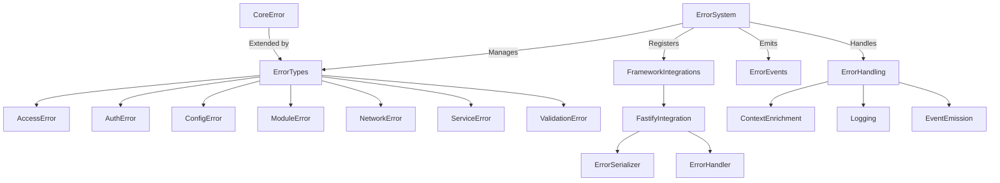

# Error System Documentation

## Table of Contents
1. [Overview](#overview)
2. [Purpose](#purpose)
3. [System Architecture](#system-architecture)
4. [Core Components](#core-components)
5. [Error Types](#error-types)
6. [Error Codes](#error-codes)
7. [Error Creation](#error-creation)
8. [Error Handling](#error-handling)
9. [Framework Integration](#framework-integration)
10. [Error Serialization](#error-serialization)
11. [Event System Integration](#event-system-integration)
12. [Contextual Errors](#contextual-errors)
13. [Testing Strategy](#testing-strategy)
14. [Best Practices](#best-practices)
15. [Extending the System](#extending-the-system)
16. [Areas for Improvement](#areas-for-improvement)

## Overview

The Error System is a comprehensive, extensible error handling framework designed to provide robust, consistent error management across the application. It standardizes error representation, provides detailed error context, and enables flexible error handling for improved debugging and system observability.

## Purpose

The primary goals of the Error System are to:
- Standardize error representation across the application
- Provide detailed error context for easier debugging
- Enable flexible error handling strategies
- Support comprehensive error logging and tracking
- Facilitate third-party system integration for error reporting
- Ensure proper error serialization for APIs
- Support environment-specific error formatting

## System Architecture

### High-Level Architecture



### Core Components

The Error System consists of the following core components:

1. **CoreError** (`src/core/errors/Error.js`)
   - Base error class for all custom errors
   - Provides advanced error serialization
   - Handles error cause tracking
   - Supports environment-specific error formatting

2. **ErrorSystem** (`src/core/errors/ErrorSystem.js`)
   - Manages error types and framework integrations
   - Provides dynamic error handler registration
   - Implements event-driven error handling
   - Acts as centralized error handling service

3. **Error Types** (`src/core/errors/types/`)
   - Specialized error classes for different domains:
     * AccessError
     * AuthError
     * ConfigError
     * ModuleError
     * NetworkError
     * ServiceError
     * ValidationError

4. **Framework Integrations**
   - Framework-specific adapters for error handling:
     * FastifyIntegration

## Error Types

### CoreError

The foundation of the Error System is the `CoreError` class, which extends the native JavaScript `Error`:

```javascript
class CoreError extends Error {
  constructor(code, message, details = {}, options = {}) {
    super(message);
    
    // Basic properties
    this.name = this.constructor.name;
    this.code = code;
    this.details = this.sanitizeDetails(details);
    this.timestamp = new Date().toISOString();

    // Handle error cause
    this.initCause(options?.cause);
    
    // Ensure instanceof works correctly
    Object.setPrototypeOf(this, new.target.prototype);
    
    // Capture stack trace if available
    if (Error.captureStackTrace) {
      Error.captureStackTrace(this, this.constructor);
    }

    // Format stack for browser environment
    if (this.isClientEnvironment()) {
      this.stack = this.formatStackTrace(this.stack);
    }
  }

  // Other methods...
}
```

### Specialized Error Types

The system provides several specialized error types that extend `CoreError`:

1. **AccessError** (HTTP 403)
   - Used for authorization and access control issues
   ```javascript
   throw new AccessError('FORBIDDEN', 'User does not have access to this resource');
   ```

2. **AuthError** (HTTP 401)
   - Used for authentication-related errors
   ```javascript
   throw new AuthError('INVALID_TOKEN', 'Authentication token is invalid');
   ```

3. **ConfigError** (HTTP 500)
   - Used for configuration and setup errors
   ```javascript
   throw new ConfigError('MISSING_REQUIRED', 'Required configuration value is missing');
   ```

4. **ModuleError** (HTTP 500)
   - Used for module system and initialization errors
   ```javascript
   throw new ModuleError('INITIALIZATION_FAILED', 'Failed to initialize module');
   ```

5. **NetworkError** (HTTP 503)
   - Used for network-related errors
   ```javascript
   throw new NetworkError('REQUEST_TIMEOUT', 'Network request timed out');
   ```

6. **ServiceError** (HTTP 503)
   - Used for service-level errors
   ```javascript
   throw new ServiceError('SERVICE_UNAVAILABLE', 'The requested service is unavailable');
   ```

7. **ValidationError** (HTTP 400)
   - Used for input validation errors
   ```javascript
   throw new ValidationError('INVALID_INPUT', 'Email format is invalid', {
     validationErrors: [{ field: 'email', message: 'Invalid email format' }]
   });
   ```

## Error Codes

Error codes follow a standardized structure to provide clear, hierarchical categorization:

```javascript
ErrorCodes = {
  // Core errors
  CORE: {
    UNKNOWN: 'UNKNOWN_ERROR',
    INITIALIZATION: 'INITIALIZATION_FAILED',
    VALIDATION: 'VALIDATION_FAILED'
  },

  // Module related
  MODULE: {
    INITIALIZATION: 'INITIALIZATION_FAILED',
    REGISTRATION: 'REGISTRATION_FAILED',
    DEPENDENCY: 'DEPENDENCY_ERROR',
    ROUTE: 'ROUTE_ERROR'
  },

  // Service related
  SERVICE: {
    INITIALIZATION: 'INITIALIZATION_FAILED',
    CONFIGURATION: 'CONFIGURATION_ERROR',
    DEPENDENCY: 'DEPENDENCY_ERROR',
    RUNTIME: 'RUNTIME_ERROR'
  },

  // Configuration related
  CONFIG: {
    VALIDATION: 'VALIDATION_FAILED',
    MISSING: 'MISSING_REQUIRED',
    INVALID: 'INVALID_VALUE'
  },

  // Validation related
  VALIDATION: {
    SCHEMA: 'SCHEMA_VALIDATION_FAILED',
    TYPE: 'INVALID_TYPE',
    REQUIRED: 'REQUIRED_FIELD_MISSING',
    FAILED: 'VALIDATION_FAILED'
  },

  // Network related
  NETWORK: {
    REQUEST: 'REQUEST_FAILED',
    RESPONSE: 'RESPONSE_ERROR',
    TIMEOUT: 'REQUEST_TIMEOUT',
    ROUTE_NOT_FOUND: 'ROUTE_NOT_FOUND'
  },

  // Authentication related
  AUTH: {
    UNAUTHORIZED: 'UNAUTHORIZED',
    TOKEN_EXPIRED: 'TOKEN_EXPIRED',
    INVALID_TOKEN: 'INVALID_TOKEN'
  },

  // Authorization related
  ACCESS: {
    FORBIDDEN: 'FORBIDDEN',
    INSUFFICIENT_RIGHTS: 'INSUFFICIENT_RIGHTS',
    RESOURCE_ACCESS_DENIED: 'RESOURCE_ACCESS_DENIED'
  }
};
```

## Error Creation

### Using the ErrorSystem

The `ErrorSystem` provides a factory method for creating errors:

```javascript
// Using the ErrorSystem to create errors
const error = errorSystem.createError(
  'ValidationError',
  ErrorCodes.VALIDATION.SCHEMA,
  'Request validation failed',
  {
    validationErrors: [
      { field: 'email', message: 'Email is required' }
    ]
  }
);
```

### Direct Error Creation

Errors can also be created directly:

```javascript
// Direct error creation
const error = new ValidationError(
  ErrorCodes.VALIDATION.SCHEMA,
  'Request validation failed',
  {
    validationErrors: [
      { field: 'email', message: 'Email is required' }
    ]
  }
);
```

### Error With Cause

Errors can include a cause, which helps with debugging and provides context:

```javascript
try {
  // Operation that might throw an error
  await database.connect();
} catch (originalError) {
  // Wrap the original error with additional context
  throw new ServiceError(
    ErrorCodes.SERVICE.INITIALIZATION,
    'Failed to initialize database service',
    { service: 'database' },
    { cause: originalError }
  );
}
```

## Error Handling

### Using the ErrorSystem

The `ErrorSystem` provides a centralized way to handle errors:

```javascript
// Register a handler for ValidationError
errorSystem.registerHandler('ValidationError', async (error, context) => {
  // Log validation errors with context
  logger.warn('Validation error:', {
    code: error.code,
    message: error.message,
    validationErrors: error.validationErrors,
    context
  });
  
  // Notify monitoring system
  await monitoring.recordValidationError(error, context);
});

// Handle an error
try {
  await validateUserInput(input);
} catch (error) {
  await errorSystem.handleError(error, {
    input,
    user: currentUser,
    operation: 'createUser'
  });
  
  // Rethrow or handle as needed
  throw error;
}
```

### Default Error Handler

The `ErrorSystem` includes a default error handler for unhandled error types:

```javascript
// Default error handler implementation
defaultErrorHandler(error, context = {}) {
  this.logger.error('Unhandled error:', {
    type: error.constructor.name,
    code: error.code,
    message: error.message,
    details: error.details,
    context
  });
}
```

### Error Context

Always provide context when handling errors:

```javascript
try {
  // Operation that might throw
  await userService.createUser(userData);
} catch (error) {
  // Handle with context
  await errorSystem.handleError(error, {
    userData,
    userId: currentUser.id,
    operation: 'createUser',
    timestamp: new Date().toISOString()
  });
  
  // Handle UI response
  showErrorNotification('Failed to create user');
}
```

## Framework Integration

### Fastify Integration

The Error System integrates with Fastify through the `FastifyIntegration`:

```javascript
// Setup in app.js
import { setupErrorHandler } from './core/errors/integrations/fastify/handler.js';

// Create Fastify instance with error serialization
const fastify = Fastify({
  logger: {
    level: process.env.LOG_LEVEL || 'info',
    serializers: {
      error: (error) => {
        const errorSystem = container.resolve('errorSystem');
        return errorSystem.serializeError(error);
      }
    }
  }
});

// Setup Fastify error handling
setupErrorHandler(fastify);
```

### Error Mapping

The integration maps framework-specific errors to core error types:

```javascript
// Mapping Fastify errors to core error types
mapError(error) {
  // Already our custom error
  if (error instanceof CoreError) {
    return error;
  }

  // Fastify validation errors
  if (error?.validation) {
    const validationError = new ValidationError(
      'FAILED',
      'Request validation failed',
      {
        validationErrors: error.validation
      }
    );
    validationError.statusCode = error.statusCode || 400;
    return validationError;
  }

  // Route not found
  if (error?.statusCode === 404) {
    const notFoundError = new NetworkError(
      'ROUTE_NOT_FOUND',
      `Route ${error.method || ''}:${error.url || ''} not found`
    );
    notFoundError.statusCode = 404;
    return notFoundError;
  }

  // Generic error
  const genericError = new CoreError(
    ErrorCodes.CORE.UNKNOWN,
    error?.message || 'An unexpected error occurred',
    {
      originalError: process.env.NODE_ENV === 'development' ? error : undefined
    }
  );

  genericError.statusCode = error?.statusCode || 500;
  return genericError;
}
```

### HTTP Status Codes

Error types map to appropriate HTTP status codes by default:

| Error Type | HTTP Status Code |
|------------|-----------------|
| AccessError | 403 Forbidden |
| AuthError | 401 Unauthorized |
| ConfigError | 500 Internal Server Error |
| ModuleError | 500 Internal Server Error |
| NetworkError | 503 Service Unavailable |
| ServiceError | 503 Service Unavailable |
| ValidationError | 400 Bad Request |

## Error Serialization

### JSON Serialization

Errors can be serialized to JSON using the `toJSON` method:

```javascript
// Error serialization
const error = new ValidationError(
  'INVALID_INPUT',
  'Validation failed',
  { validationErrors: [{ field: 'email', message: 'Invalid email' }] }
);

const serialized = error.toJSON();
// {
//   name: 'ValidationError',
//   code: 'VALIDATION_INVALID_INPUT',
//   message: 'Validation failed',
//   details: { validationErrors: [{ field: 'email', message: 'Invalid email' }] },
//   timestamp: '2023-07-21T12:34:56.789Z',
//   stack: '...' // Only in development environment
// }
```

### Environment-Specific Serialization

Error serialization is environment-aware:

```javascript
isDevEnvironment() {
  if (typeof process !== 'undefined' && process.env) {
    return process.env.NODE_ENV === 'development' || process.env.NODE_ENV === 'test';
  }
  return this.isClientEnvironment() && window.ENV === 'development';
}

toJSON() {
  const json = {
    name: this.name,
    code: this.code,
    message: this.message,
    details: this.details,
    timestamp: this.timestamp
  };

  // Only include stack if it exists AND we're in dev
  if (this.isDevEnvironment() && this.stack) {
    json.stack = this.stack;
  }

  // Include cause if present
  if (this.cause) {
    json.cause = {
      message: this.cause.message,
      name: this.cause.name || 'Error'
    };
    
    // Only include cause stack if it exists AND we're in dev
    if (this.isDevEnvironment() && this.cause.stack) {
      json.cause.stack = this.cause.stack;
    }
  }

  return json;
}
```

## Event System Integration

The `ErrorSystem` integrates with the event system by emitting events:

```javascript
class ErrorSystem extends EventEmitter {
  // ...other methods

  async handleError(error, context = {}) {
    // ...error handling logic

    // Emit error event
    this.emit('error:handled', { error, context });
  }

  // ...other methods
}
```

Modules and services can listen for these events:

```javascript
// Listen for error events
errorSystem.on('error:handled', ({ error, context }) => {
  // Record error in metrics, monitoring, etc.
  metrics.incrementCounter('errors', {
    type: error.constructor.name,
    code: error.code
  });
});
```

## Contextual Errors

### Adding Context to Errors

```javascript
// Add context when creating errors
const error = new ValidationError(
  ErrorCodes.VALIDATION.SCHEMA,
  'User validation failed',
  {
    validationErrors: [
      { field: 'email', message: 'Email is required' }
    ],
    userId: user.id,
    requestId: request.id
  }
);

// Add context when handling errors
try {
  await userService.updateUser(user);
} catch (error) {
  await errorSystem.handleError(error, {
    userId: user.id,
    operation: 'updateUser',
    requestId: request.id,
    timestamp: new Date().toISOString()
  });
}
```

### Error Cause Chain

```javascript
try {
  // Low-level operation
  await db.query('INSERT INTO users VALUES ($1, $2)', [user.id, user.name]);
} catch (dbError) {
  // Add database context
  const serviceError = new ServiceError(
    ErrorCodes.SERVICE.RUNTIME,
    'Database operation failed',
    { query: 'INSERT INTO users' },
    { cause: dbError }
  );
  
  try {
    // Higher-level operation
    await processUser(user);
  } catch (processError) {
    // Add process context
    throw new ModuleError(
      ErrorCodes.MODULE.RUNTIME,
      'User processing failed',
      { userId: user.id },
      { cause: processError }
    );
  }
  
  throw serviceError;
}
```

## Testing Strategy

### Testing Error Creation

```javascript
describe('CoreError', () => {
  test('should create error with minimal args', () => {
    const error = new CoreError('TEST_CODE', 'Test message');
    
    expect(error.name).toBe('CoreError');
    expect(error.code).toBe('TEST_CODE');
    expect(error.message).toBe('Test message');
    expect(error.details).toEqual({});
    expect(error.timestamp).toBeDefined();
  });
  
  test('should create error with details', () => {
    const details = { foo: 'bar' };
    const error = new CoreError('TEST_CODE', 'Test message', details);
    
    expect(error.details).toEqual(details);
  });
  
  test('should create error with cause', () => {
    const cause = new Error('Original error');
    const error = new CoreError('TEST_CODE', 'Test message', {}, { cause });
    
    expect(error.cause).toBe(cause);
  });
  
  test('should serialize to JSON', () => {
    const error = new CoreError('TEST_CODE', 'Test message');
    const json = error.toJSON();
    
    expect(json.name).toBe('CoreError');
    expect(json.code).toBe('TEST_CODE');
    expect(json.message).toBe('Test message');
  });
});
```

### Testing ErrorSystem

```javascript
describe('ErrorSystem', () => {
  let errorSystem;
  let mockLogger;
  
  beforeEach(() => {
    mockLogger = {
      error: jest.fn(),
      warn: jest.fn(),
      info: jest.fn()
    };
    
    errorSystem = new ErrorSystem({
      logger: mockLogger
    });
    
    errorSystem.initialize();
  });
  
  test('should create error with correct type', () => {
    const error = errorSystem.createError(
      'ValidationError',
      'TEST_CODE',
      'Test message'
    );
    
    expect(error).toBeInstanceOf(ValidationError);
    expect(error.code).toBe('VALIDATION_TEST_CODE');
    expect(error.message).toBe('Test message');
  });
  
  test('should handle error with registered handler', async () => {
    // Register custom handler
    const mockHandler = jest.fn();
    errorSystem.registerHandler('ValidationError', mockHandler);
    
    // Create and handle error
    const error = new ValidationError('TEST_CODE', 'Test message');
    const context = { foo: 'bar' };
    
    await errorSystem.handleError(error, context);
    
    // Verify handler was called
    expect(mockHandler).toHaveBeenCalledWith(error, context);
  });
  
  test('should fall back to default handler', async () => {
    // Create and handle error with no registered handler
    const error = new CoreError('TEST_CODE', 'Test message');
    const context = { foo: 'bar' };
    
    await errorSystem.handleError(error, context);
    
    // Verify default handler behavior (logger called)
    expect(mockLogger.error).toHaveBeenCalled();
  });
});
```

### Testing Error Integration

```javascript
describe('FastifyIntegration', () => {
  let fastify;
  let integration;
  
  beforeEach(async () => {
    // Create Fastify instance
    fastify = Fastify();
    
    // Create and initialize integration
    integration = new FastifyIntegration();
    await integration.initialize(fastify);
    
    // Register test route
    fastify.get('/test', () => {
      throw new ValidationError('TEST', 'Test error');
    });
    
    await fastify.ready();
  });
  
  afterEach(async () => {
    await fastify.close();
  });
  
  test('should handle custom errors', async () => {
    const response = await fastify.inject({
      method: 'GET',
      url: '/test'
    });
    
    expect(response.statusCode).toBe(400); // ValidationError status code
    
    const payload = JSON.parse(response.payload);
    expect(payload.code).toBe('VALIDATION_TEST');
    expect(payload.message).toBe('Test error');
  });
  
  test('should map framework errors', async () => {
    const response = await fastify.inject({
      method: 'GET',
      url: '/not-found'
    });
    
    expect(response.statusCode).toBe(404);
    
    const payload = JSON.parse(response.payload);
    expect(payload.code).toBe('NETWORK_ROUTE_NOT_FOUND');
  });
});
```

## Best Practices

### 1. Use Specific Error Types

Always use the most specific error type for the situation:

```javascript
// Bad - generic error
throw new Error('User not found');

// Good - specific error type
throw new ServiceError(
  ErrorCodes.SERVICE.NOT_FOUND,
  'User not found',
  { userId }
);
```

### 2. Provide Detailed Context

Include relevant context in error details:

```javascript
// Bad - minimal context
throw new ValidationError(
  ErrorCodes.VALIDATION.FAILED,
  'Validation failed'
);

// Good - detailed context
throw new ValidationError(
  ErrorCodes.VALIDATION.FAILED,
  'User validation failed',
  {
    validationErrors: [
      { field: 'email', message: 'Email is required' },
      { field: 'password', message: 'Password must be at least 8 characters' }
    ],
    userId,
    requestId,
    timestamp: new Date().toISOString()
  }
);
```

### 3. Use Error Cause for Nested Errors

Preserve the error chain with `cause`:

```javascript
try {
  await userRepository.save(user);
} catch (dbError) {
  // Wrap with higher-level context
  throw new ServiceError(
    ErrorCodes.SERVICE.RUNTIME,
    'Failed to save user',
    { userId: user.id },
    { cause: dbError }
  );
}
```

### 4. Centralize Error Handling

Use the `ErrorSystem` for centralized handling:

```javascript
try {
  await operation();
} catch (error) {
  // Let the ErrorSystem handle it
  await errorSystem.handleError(error, context);
  
  // Then decide whether to rethrow, return, etc.
  return { success: false, error: error.message };
}
```

### 5. Environment-Aware Error Responses

Be careful about exposing sensitive information:

```javascript
// In controller/API layer
try {
  const result = await userService.createUser(userData);
  return { success: true, user: result };
} catch (error) {
  // Log the full error with context
  await errorSystem.handleError(error, { userData, operation: 'createUser' });
  
  // Return sanitized error to client
  return {
    success: false,
    error: {
      code: error.code,
      message: error.message,
      // Only include safe details
      validationErrors: error.validationErrors
    }
  };
}
```

## Extending the System

### Custom Error Types

Create custom error types for domain-specific errors:

```javascript
import { CoreError } from '@core/errors/Error';

class PaymentError extends CoreError {
  constructor(code, message, details = {}, options = {}) {
    // Prefix code with domain
    super(`PAYMENT_${code}`, message, details, options);
    
    // Set default status code
    this.statusCode = 402; // Payment Required
  }
}

// Usage
throw new PaymentError(
  'INSUFFICIENT_FUNDS',
  'Insufficient funds to complete transaction',
  { accountId, required: 100, available: 50 }
);
```

### Custom Error Handlers

Register custom handlers for specific error types:

```javascript
// Register handler for PaymentError
errorSystem.registerHandler('PaymentError', async (error, context) => {
  // Log payment errors
  logger.warn('Payment error:', {
    code: error.code,
    message: error.message,
    details: error.details,
    context
  });
  
  // Notify payment service
  await paymentService.notifyErrorMonitoring(error, context);
  
  // Update metrics
  metrics.incrementCounter('payment.errors', {
    code: error.code
  });
});
```

### Framework Integration

Create custom framework integrations:

```javascript
import { IFrameworkIntegration } from '@core/errors/integrations/IFrameworkIntegration';

class ExpressIntegration extends IFrameworkIntegration {
  async initialize(app, options = {}) {
    // Register error middleware
    app.use((error, req, res, next) => {
      // Map to core error
      const mappedError = this.mapError(error);
      
      // Serialize error
      const serialized = this.serializeError(mappedError, {
        url: req.url,
        method: req.method,
        requestId: req.id
      });
      
      // Send response
      res.status(mappedError.statusCode || 500).json(serialized);
    });
  }
  
  mapError(error) {
    // Mapping logic
  }
  
  serializeError(error, context) {
    // Serialization logic
  }
}
```

## Areas for Improvement

1. **Enhanced Error Tracking**:
   - Implement error aggregation and deduplication
   - Add unique error identifiers for tracing through the system
   - Support correlation IDs for distributed tracing
   - Add timestamps for error lifecycle events

2. **Advanced Framework Integrations**:
   - Complete the `IntegrationRegistry` implementation
   - Add support for more frameworks (Express, Koa, etc.)
   - Create client-side error handling integration
   - Support GraphQL error formatting

3. **Error Reporting Services**:
   - Add integration with third-party error reporting services
   - Support for Sentry, Rollbar, New Relic, etc.
   - Batch error reporting for high-volume systems
   - Controlled sampling for production environments

4. **Performance Optimization**:
   - Optimize error serialization for high-throughput APIs
   - Implement error rate limiting to prevent cascading failures
   - Add intelligent error suppression for noisy errors
   - Benchmark and optimize error creation performance

5. **Error Analysis Tools**:
   - Create tools for analyzing error patterns
   - Implement error categorization and prioritization
   - Add support for automated root cause analysis
   - Develop visualization for error trends and distributions

6. **Security Enhancements**:
   - Improve sanitization of sensitive data in error details
   - Add configurable redaction policies for error fields
   - Implement security scanning for error messages
   - Add protection against error message information leakage

7. **Developer Experience**:
   - Create better error debugging tools and helpers
   - Add code location and context to error objects
   - Implement contextual help for common errors
   - Add links to documentation for error resolution

8. **Testing Improvements**:
   - Create more comprehensive testing utilities
   - Add error simulation capabilities for testing
   - Implement automated error scenario testing
   - Develop tools for testing error handling consistency