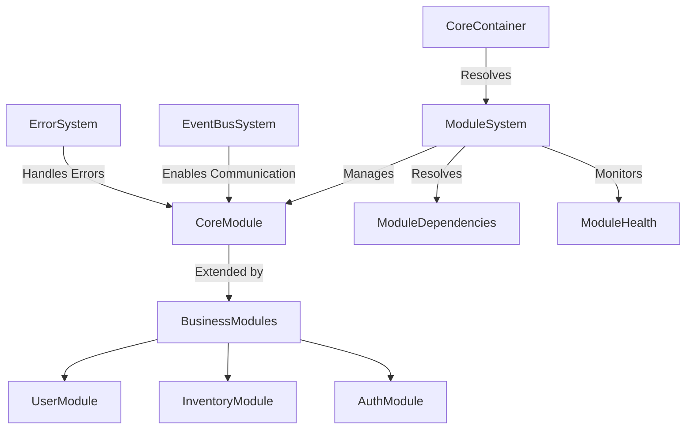
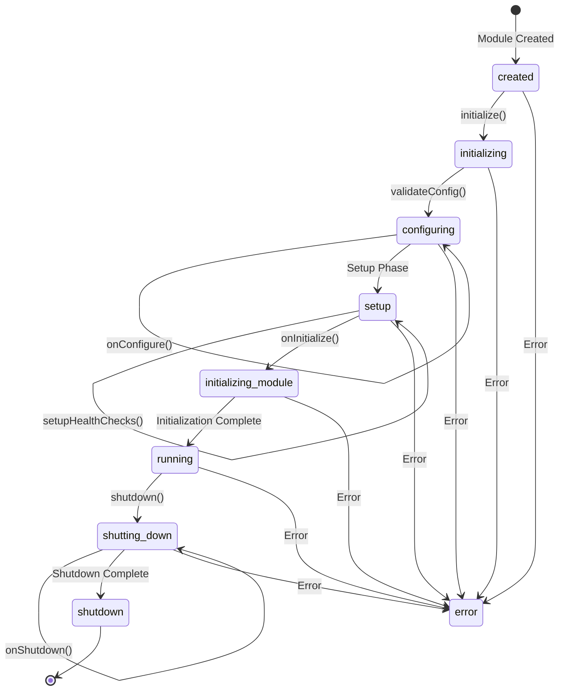

# Module System Documentation

## Table of Contents
1. [Overview](#overview)
2. [Purpose](#purpose)
3. [System Architecture](#system-architecture)
4. [Core Components](#core-components)
5. [Module Lifecycle](#module-lifecycle)
6. [Dependency Management](#dependency-management)
7. [State Management](#state-management)
8. [Health Monitoring](#health-monitoring)
9. [Error Handling](#error-handling)
10. [Event System Integration](#event-system-integration)
11. [Module Implementation](#module-implementation)
12. [Module Registration](#module-registration)
13. [Testing Strategy](#testing-strategy)
14. [Best Practices](#best-practices)
15. [Extending the System](#extending-the-system)
16. [Areas for Improvement](#areas-for-improvement)

## Overview

The Module System provides a standardized approach to creating, managing, and connecting application components. It enforces consistent module lifecycle management, dependency injection, health monitoring, event communication, and error handling. This system allows for organizing business logic into cohesive, reusable modules that can be independently developed, tested, and composed.

## Purpose

The primary goals of the Module System are to:
- Provide a consistent structure for business logic
- Enforce proper lifecycle management
- Enable loose coupling through dependency injection
- Facilitate module-to-module communication
- Support comprehensive health monitoring
- Establish standardized error handling
- Allow for independent testing of modules
- Promote code organization and maintainability

## System Architecture

### High-Level Architecture



### Layer Structure

The TSMIS architecture is built on three main layers:
1. **Core Systems** - Fundamental infrastructure (Container, ErrorSystem, EventBusSystem, ModuleSystem)
2. **Service Systems** - Common service functionality 
3. **Business Modules** - Business domain logic

## Core Components

### ModuleSystem

The `ModuleSystem` class is responsible for managing modules:

```javascript
class ModuleSystem extends EventEmitter {
  static dependencies = ['errorSystem', 'eventBusSystem', 'config'];

  constructor(deps) {
    super();
    this.deps = deps;
    this.modules = new Map();
    this.initialized = false;
    this.eventBus = deps.eventBusSystem?.getEventBus();
    this.state = {
      status: 'created',
      startTime: null,
      errors: [],
      metrics: new Map(),
      moduleHealth: new Map(),
      healthCheckIntervals: new Map()
    };
  }

  // Key methods
  async register(name, ModuleClass, config = {}) { /* ... */ }
  async resolve(name) { /* ... */ }
  async unregister(name) { /* ... */ }
  async initialize() { /* ... */ }
  async shutdown() { /* ... */ }
  async handleModuleError(moduleName, error) { /* ... */ }
  async getSystemHealth() { /* ... */ }
  resolveDependencyOrder() { /* ... */ }
}
```

### CoreModule

The `CoreModule` class serves as the base class for all modules:

```javascript
class CoreModule extends EventEmitter {
  static dependencies = ['errorSystem', 'eventBusSystem', 'config'];
  static version = '1.0.0';

  constructor(deps = {}) {
    super();
    this.deps = deps;
    this.eventBus = deps.eventBusSystem?.getEventBus();
    this.initialized = false;
    this.config = deps.config || {};
    this.state = {
      status: 'created',
      startTime: null,
      errors: [],
      metrics: new Map(),
      healthChecks: new Map(),
      lastHealthCheck: null
    };
  }

  // Lifecycle methods
  async validateDependencies() { /* ... */ }
  async validateConfig() { /* ... */ }
  async initialize() { /* ... */ }
  async setupHealthChecks() { /* ... */ }
  async handleError(error, context = {}) { /* ... */ }
  async emit(eventName, ...args) { /* ... */ }
  async shutdown() { /* ... */ }

  // Health monitoring
  registerHealthCheck(name, checkFn) { /* ... */ }
  startHealthChecks() { /* ... */ }
  async checkHealth() { /* ... */ }

  // Metrics recording
  recordMetric(name, value, tags = {}) { /* ... */ }

  // Lifecycle hooks for derived classes
  async onValidateConfig() { /* ... */ }
  async onConfigure() { /* ... */ }
  async setupEventHandlers() { /* ... */ }
  async onSetupHealthChecks() { /* ... */ }
  async onInitialize() { /* ... */ }
  async onShutdown() { /* ... */ }
}
```

## Module Lifecycle

The Module System enforces a consistent lifecycle for all modules:

### Lifecycle Phases

1. **Creation**
   - Module instance is created
   - Dependencies are injected
   - Initial validation

2. **Configuration**
   - Module configuration is validated
   - Module-specific configuration is applied
   - Resources are prepared

3. **Setup**
   - Event handlers are registered
   - Health checks are configured
   - Resources are connected

4. **Initialization**
   - Module-specific initialization
   - State initialization
   - Ready for operation

5. **Operation**
   - Module is fully operational
   - Event handling and processing
   - Regular health monitoring

6. **Shutdown**
   - Resources are released
   - Event handlers are unregistered
   - Clean termination

### Lifecycle Flow



### Lifecycle Method Sequence

1. **Module.validateDependencies()** - Validates required dependencies
2. **Module.validateConfig()** - Validates module configuration
3. **Module.onValidateConfig()** - Custom configuration validation
4. **Module.onConfigure()** - Apply configuration and setup module state
5. **Module.setupEventHandlers()** - Register event handlers
6. **Module.setupHealthChecks()** - Configure health checks
7. **Module.onSetupHealthChecks()** - Module-specific health checks
8. **Module.onInitialize()** - Complete module initialization
9. **Module.onShutdown()** - Custom shutdown logic

## Dependency Management

### Module Dependencies

Modules declare their dependencies using the static `dependencies` property:

```javascript
class UserModule extends CoreModule {
  static dependencies = ['errorSystem', 'eventBusSystem', 'config', 'database', 'auth'];
  
  constructor(deps) {
    super(deps);
    this.database = deps.database;
    this.auth = deps.auth;
  }
}
```

### Dependency Resolution

The `ModuleSystem` resolves dependencies between modules:

```javascript
resolveDependencyOrder() {
  const visited = new Set();
  const visiting = new Set();
  const order = [];

  const visit = (name) => {
    if (visited.has(name)) return;
    if (visiting.has(name)) {
      throw new ModuleError(
        'CIRCULAR_DEPENDENCY',
        `Circular dependency detected for module: ${name}`
      );
    }

    visiting.add(name);

    const module = this.modules.get(name);
    const deps = module.constructor.dependencies || [];

    for (const dep of deps) {
      if (!this.modules.has(dep)) {
        throw new ModuleError(
          'MISSING_DEPENDENCY',
          `Module ${name} requires missing module: ${dep}`
        );
      }
      visit(dep);
    }

    visiting.delete(name);
    visited.add(name);
    order.push(name);
  };

  for (const name of this.modules.keys()) {
    visit(name);
  }

  return order;
}
```

### Dependency Validation

Modules validate their dependencies during construction:

```javascript
validateDependencies() {
  // Check required dependencies
  const missing = this.constructor.dependencies.filter(
    dep => !this.deps[dep]
  );

  if (missing.length > 0) {
    throw new ModuleError(
      'MISSING_DEPENDENCIES',
      `Missing required dependencies: ${missing.join(', ')}`
    );
  }

  // Validate eventBusSystem dependency
  if (this.deps.eventBusSystem && typeof this.deps.eventBusSystem.getEventBus !== 'function') {
    throw new ModuleError(
      'INVALID_EVENTBUS_SYSTEM',
      'EventBusSystem missing required method: getEventBus'
    );
  }

  if (this.deps.errorSystem && typeof this.deps.errorSystem.handleError !== 'function') {
    throw new ModuleError(
      'INVALID_ERROR_SYSTEM',
      'ErrorSystem missing required methods'
    );
  }
}
```

## State Management

### Module States

Modules transition through the following states during their lifecycle:

- **created**: Initial module state after instantiation
- **initializing**: During initialization process
- **running**: Module is active and operational
- **shutting_down**: During shutdown process
- **shutdown**: Module is inactive
- **error**: Error state when something fails

### State Tracking

The state object stores comprehensive module metadata:

```javascript
this.state = {
  status: 'created',        // Current module state
  startTime: null,          // When module was started
  errors: [],               // Error history
  metrics: new Map(),       // Performance metrics
  healthChecks: new Map(),  // Health check functions
  lastHealthCheck: null     // Last health check result
};
```

### State Transitions

The `ModuleSystem` manages state transitions:

```javascript
async initialize() {
  if (this.initialized) {
    throw new ModuleError(
      'ALREADY_INITIALIZED',
      'Module is already initialized'
    );
  }

  try {
    this.state.startTime = Date.now();
    this.state.status = 'initializing';

    // Configuration phase
    await this.validateConfig();
    await this.onConfigure();

    // Setup phase
    await this.setupEventHandlers();
    await this.setupHealthChecks();

    // Initialize phase
    await this.onInitialize();

    // Start health check monitoring
    this.startHealthChecks();
    
    this.initialized = true;
    this.state.status = 'running';

    await this.emit('module:initialized', {
      name: this.constructor.name,
      timestamp: new Date().toISOString()
    });

    return this;

  } catch (error) {
    this.state.status = 'error';
    this.state.errors.push({
      timestamp: new Date().toISOString(),
      error: error.message
    });

    throw new ModuleError(
      'INITIALIZATION_FAILED',
      'Failed to initialize module',
      { originalError: error }
    );
  }
}
```

## Health Monitoring

### Health Check Registration

Modules register health checks during initialization:

```javascript
async setupHealthChecks() {
  // Register default health checks
  this.registerHealthCheck('state', async () => {
    return {
      status: this.state.status === 'running' ? 'healthy' : 'unhealthy',
      uptime: Date.now() - this.state.startTime,
      errorCount: this.state.errors.length
    };
  });

  // Allow modules to add their own health checks
  await this.onSetupHealthChecks();
}

registerHealthCheck(name, checkFn) {
  if (typeof checkFn !== 'function') {
    throw new ModuleError(
      'INVALID_HEALTH_CHECK',
      `Health check ${name} must be a function`
    );
  }
  this.state.healthChecks.set(name, checkFn);
}
```

### Health Check Execution

The `checkHealth` method runs all registered health checks:

```javascript
async checkHealth() {
  const results = {};
  let overallStatus = 'healthy';

  for (const [name, checkFn] of this.state.healthChecks) {
    try {
      results[name] = await checkFn();
      if (results[name].status !== 'healthy') {
        overallStatus = 'unhealthy';
      }
    } catch (error) {
      results[name] = {
        status: 'error',
        error: error.message
      };
      overallStatus = 'unhealthy';
    }
  }

  return {
    name: this.constructor.name,
    version: this.constructor.version,
    status: overallStatus,
    timestamp: new Date().toISOString(),
    checks: results
  };
}
```

### Health Monitoring

The `ModuleSystem` monitors the health of all modules:

```javascript
async startModuleHealthMonitoring(name) {
  const module = this.modules.get(name);
  if (!module) return;

  // Clear any existing interval
  if (this.state.healthCheckIntervals.has(name)) {
    clearInterval(this.state.healthCheckIntervals.get(name));
  }

  // Monitor module health status
  const intervalId = setInterval(async () => {
    try {
      const health = await module.checkHealth();
      this.state.moduleHealth.set(name, health);

      if (health.status !== 'healthy') {
        await this.handleModuleError(name, new ModuleError(
          'UNHEALTHY_MODULE',
          `Module ${name} is unhealthy`,
          { health }
        ));
      }
    } catch (error) {
      await this.handleModuleError(name, error);
    }
  }, 60000); // Check every minute

  // Track the interval for proper cleanup
  this.state.healthCheckIntervals.set(name, intervalId);
}
```

### System Health Check

The `ModuleSystem` provides a `getSystemHealth` method to check the health of all modules:

```javascript
async getSystemHealth() {
  const moduleHealth = {};
  let systemStatus = 'healthy';

  for (const [name, module] of this.modules) {
    try {
      const health = await module.checkHealth();
      moduleHealth[name] = health;
      
      if (health.status !== 'healthy') {
        systemStatus = 'degraded';
      }
    } catch (error) {
      moduleHealth[name] = {
        status: 'error',
        error: error.message
      };
      systemStatus = 'unhealthy';
    }
  }

  return {
    status: systemStatus,
    timestamp: new Date().toISOString(),
    uptime: Date.now() - this.state.startTime,
    modules: moduleHealth,
    errorCount: this.state.errors.length
  };
}
```

## Error Handling

### Module Error Handling

Each module has an `handleError` method for error processing:

```javascript
async handleError(error, context = {}) {
  const safeContext = context || {};

  // Add error to state
  this.state.errors.push({
    timestamp: new Date().toISOString(),
    error: error.message,
    context: safeContext
  });

  // Trim error history
  if (this.state.errors.length > 100) {
    this.state.errors.shift();
  }

  // Forward to error system
  if (this.deps.errorSystem) {
    try {
      await this.deps.errorSystem.handleError(error, {
        module: this.constructor.name,
        ...safeContext
      });
    } catch (handlerError) {
      // Log error handling failure
      console.error('Error in error handling:', handlerError);
    }
  }

  // Emit error event
  await this.emit('module:error', {
    module: this.constructor.name,
    error,
    context: safeContext
  });

  return this;
}
```

### System-Level Error Handling

The `ModuleSystem` includes special error handling for modules:

```javascript
async handleModuleError(moduleName, error) {
  // Add error to state
  this.state.errors.push({
    timestamp: new Date().toISOString(),
    module: moduleName,
    error: error.message
  });

  // Trim error history
  if (this.state.errors.length > 100) {
    this.state.errors.shift();
  }

  // Forward to error system if available
  if (this.deps.errorSystem) {
    try {
      await this.deps.errorSystem.handleError(error, {
        source: 'ModuleSystem',
        module: moduleName
      });
    } catch (handlerError) {
      // Handle error system failures
      this.state.errors.push({
        timestamp: new Date().toISOString(),
        error: handlerError.message,
        context: { phase: 'error-handling' }
      });
    }
  }

  // Emit error event
  await this.emit('module:error', {
    module: moduleName,
    error,
    timestamp: new Date().toISOString()
  });
}
```

## Event System Integration

### Dual Event Emission

Modules feature dual event emission:

```javascript
async emit(eventName, ...args) {
  // Emit through local EventEmitter
  const localEmitResult = super.emit(eventName, ...args);

  // Broadcast through eventBus if available
  if (this.eventBus?.emit) {
    try {
      await this.eventBus.emit(eventName, ...args);
    } catch (error) {
      await this.handleError(error, {
        event: eventName,
        args
      });
    }
  }

  return localEmitResult;
}
```

### Event Handler Setup

Modules set up event handlers in the `setupEventHandlers` method:

```javascript
async setupEventHandlers() {
  // Get eventBus from eventBusSystem
  const eventBus = this.deps.eventBusSystem.getEventBus();
  
  // Store subscription IDs for cleanup
  this.subscriptions = [
    eventBus.subscribe('user.created', this.handleUserCreated.bind(this)),
    eventBus.subscribe('user.updated', this.handleUserUpdated.bind(this)),
    eventBus.subscribe('user.deleted', this.handleUserDeleted.bind(this))
  ];
}
```

### Event Cleanup

Modules clean up event subscriptions during shutdown:

```javascript
async onShutdown() {
  // Clean up subscriptions
  if (this.eventBus) {
    for (const subId of this.subscriptions) {
      this.eventBus.unsubscribe(subId);
    }
  }
  this.subscriptions = [];
}
```

## Module Implementation

### Basic Module Template

```javascript
import { CoreModule } from '@core/module/Module';
import { ValidationError } from '@core/errors';

export class UserModule extends CoreModule {
  static dependencies = ['errorSystem', 'eventBusSystem', 'config', 'database'];
  static version = '1.0.0';
  
  constructor(deps) {
    super(deps);
    this.db = deps.database;
    this.subscriptions = [];
  }
  
  async onValidateConfig() {
    // Validate required configuration
    if (!this.config.userRoles) {
      throw new ValidationError(
        'MISSING_CONFIG',
        'User roles configuration is required'
      );
    }
    return true;
  }
  
  async onConfigure() {
    // Initialize module state
    this.userRoles = this.config.userRoles;
    this.cacheEnabled = this.config.cache?.enabled || false;
    this.userCache = new Map();
  }
  
  async setupEventHandlers() {
    const eventBus = this.deps.eventBusSystem.getEventBus();
    
    this.subscriptions = [
      eventBus.subscribe('user.created', this.handleUserCreated.bind(this)),
      eventBus.subscribe('user.updated', this.handleUserUpdated.bind(this)),
      eventBus.subscribe('user.deleted', this.handleUserDeleted.bind(this))
    ];
  }
  
  async onSetupHealthChecks() {
    // Register custom health checks
    this.registerHealthCheck('database', async () => {
      const connected = await this.db.checkConnection();
      return {
        status: connected ? 'healthy' : 'unhealthy',
        details: { connected }
      };
    });
    
    this.registerHealthCheck('cache', async () => {
      return {
        status: 'healthy',
        size: this.userCache.size,
        enabled: this.cacheEnabled
      };
    });
  }
  
  async onInitialize() {
    // Perform initialization tasks
    await this.db.ensureUserTable();
    
    // Record metric
    this.recordMetric('users.initialized', 1);
  }
  
  // Business methods
  async createUser(userData) {
    try {
      // Validate user data
      if (!userData.email) {
        throw new ValidationError('MISSING_EMAIL', 'Email is required');
      }
      
      // Create user in database
      const user = await this.db.users.create(userData);
      
      // Update cache
      if (this.cacheEnabled) {
        this.userCache.set(user.id, user);
      }
      
      // Emit event
      await this.emit('user.created', user);
      
      // Record metric
      this.recordMetric('users.created', 1);
      
      return user;
    } catch (error) {
      await this.handleError(error, {
        method: 'createUser',
        userData
      });
      throw error;
    }
  }
  
  // Event handlers
  async handleUserCreated(event) {
    try {
      // Handle event
      if (this.cacheEnabled) {
        this.userCache.set(event.data.id, event.data);
      }
    } catch (error) {
      await this.handleError(error, {
        event,
        handler: 'handleUserCreated'
      });
    }
  }
  
  async onShutdown() {
    // Clean up resources
    this.userCache.clear();
    
    // Clean up subscriptions
    for (const subId of this.subscriptions) {
      this.eventBus.unsubscribe(subId);
    }
  }
}
```

### Factory Function

```javascript
export function createUserModule(deps = {}) {
  return new UserModule(deps);
}
```

## Module Registration

### Module Registration

```javascript
// In application startup
import { createUserModule } from './modules/UserModule';

async function setupModules(container) {
  const moduleSystem = await container.resolve('moduleSystem');
  
  // Register modules with configuration
  await moduleSystem.register('userModule', createUserModule, {
    userRoles: ['admin', 'user', 'guest'],
    cache: {
      enabled: true,
      ttl: 3600
    }
  });
  
  // Initialize all modules
  await moduleSystem.initialize();
}
```

### Module Resolution

```javascript
// Get a module instance
const userModule = await moduleSystem.resolve('userModule');

// Use module functionality
const user = await userModule.createUser({
  email: 'user@example.com',
  name: 'Test User'
});
```

## Testing Strategy

### Unit Testing Modules

```javascript
describe('UserModule', () => {
  let userModule;
  let mockDatabase;
  let mockEventBus;
  let mockErrorSystem;
  
  beforeEach(async () => {
    // Create mock dependencies
    mockDatabase = {
      users: {
        create: jest.fn().mockResolvedValue({ id: 'user-123', email: 'test@example.com' })
      },
      checkConnection: jest.fn().mockResolvedValue(true),
      ensureUserTable: jest.fn().mockResolvedValue(true)
    };
    
    mockEventBus = {
      emit: jest.fn().mockResolvedValue(true),
      subscribe: jest.fn().mockReturnValue('sub-id'),
      unsubscribe: jest.fn()
    };
    
    mockErrorSystem = {
      handleError: jest.fn()
    };
    
    const mockEventBusSystem = {
      getEventBus: () => mockEventBus
    };
    
    // Create module with dependencies
    userModule = new UserModule({
      database: mockDatabase,
      eventBusSystem: mockEventBusSystem,
      errorSystem: mockErrorSystem,
      config: {
        userRoles: ['admin', 'user'],
        cache: { enabled: true }
      }
    });
    
    // Initialize module
    await userModule.initialize();
  });
  
  afterEach(async () => {
    // Clean up
    await userModule.shutdown();
  });
  
  test('should create a user', async () => {
    const userData = { email: 'test@example.com', name: 'Test User' };
    const result = await userModule.createUser(userData);
    
    // Verify database was called
    expect(mockDatabase.users.create).toHaveBeenCalledWith(userData);
    
    // Verify event was emitted
    expect(mockEventBus.emit).toHaveBeenCalledWith('user.created', expect.objectContaining({
      id: 'user-123'
    }));
    
    // Verify result
    expect(result).toEqual({ id: 'user-123', email: 'test@example.com' });
  });
  
  test('should handle validation errors', async () => {
    const userData = { name: 'Test User' }; // Missing email
    
    // Expect error to be thrown
    await expect(userModule.createUser(userData)).rejects.toThrow('Email is required');
    
    // Verify error was handled
    expect(mockErrorSystem.handleError).toHaveBeenCalled();
    
    // Verify no database call or event
    expect(mockDatabase.users.create).not.toHaveBeenCalled();
    expect(mockEventBus.emit).not.toHaveBeenCalled();
  });
  
  test('should check health', async () => {
    const health = await userModule.checkHealth();
    
    expect(health.status).toBe('healthy');
    expect(health.checks).toHaveProperty('database');
    expect(health.checks).toHaveProperty('cache');
    expect(health.checks.database.status).toBe('healthy');
  });
});
```

### Testing the ModuleSystem

```javascript
describe('ModuleSystem', () => {
  let moduleSystem;
  let container;
  
  beforeEach(async () => {
    // Create container with dependencies
    container = new CoreContainer();
    
    // Register core systems
    container.register('errorSystem', createErrorSystem);
    container.register('config', () => ({}));
    container.register('eventBusSystem', createEventBusSystem);
    
    // Initialize container
    await container.initialize();
    
    // Resolve module system
    moduleSystem = await container.resolve('moduleSystem');
  });
  
  afterEach(async () => {
    // Clean up
    await container.shutdown();
  });
  
  test('should register and initialize a module', async () => {
    // Register a simple module
    class TestModule extends CoreModule {
      async onInitialize() {
        this.initialized = true;
      }
    }
    
    await moduleSystem.register('testModule', TestModule);
    await moduleSystem.initialize();
    
    // Resolve the module
    const testModule = await moduleSystem.resolve('testModule');
    
    expect(testModule).toBeInstanceOf(TestModule);
    expect(testModule.initialized).toBe(true);
  });
  
  test('should resolve module dependencies', async () => {
    // Register modules with dependencies
    class DependencyModule extends CoreModule {}
    
    class DependentModule extends CoreModule {
      static dependencies = ['dependencyModule'];
      
      constructor(deps) {
        super(deps);
        this.dependency = deps.dependencyModule;
      }
    }
    
    await moduleSystem.register('dependencyModule', DependencyModule);
    await moduleSystem.register('dependentModule', DependentModule);
    await moduleSystem.initialize();
    
    // Resolve dependent module
    const dependentModule = await moduleSystem.resolve('dependentModule');
    
    expect(dependentModule.dependency).toBeInstanceOf(DependencyModule);
  });
  
  test('should detect circular dependencies', async () => {
    // Create modules with circular dependencies
    class ModuleA extends CoreModule {
      static dependencies = ['moduleB'];
    }
    
    class ModuleB extends CoreModule {
      static dependencies = ['moduleA'];
    }
    
    // Register modules
    await moduleSystem.register('moduleA', ModuleA);
    await moduleSystem.register('moduleB', ModuleB);
    
    // Initialization should fail
    await expect(moduleSystem.initialize()).rejects.toThrow(/Circular dependency/);
  });
});
```

## Best Practices

### 1. Explicit Dependencies

Always declare dependencies explicitly:

```javascript
class UserModule extends CoreModule {
  static dependencies = ['errorSystem', 'eventBusSystem', 'config', 'database', 'auth'];
  
  constructor(deps) {
    super(deps);
    this.database = deps.database;
    this.auth = deps.auth;
  }
}
```

### 2. Proper Error Handling

Always use `handleError` with context:

```javascript
try {
  await this.database.query('SELECT * FROM users');
} catch (error) {
  await this.handleError(error, {
    operation: 'getUserList',
    context: 'UserModule'
  });
  throw error; // Re-throw or handle as needed
}
```

### 3. Clean Resource Management

Ensure resources are properly managed:

```javascript
async onInitialize() {
  // Allocate resources
  this.connection = await createConnection();
  this.cache = new Cache();
}

async onShutdown() {
  // Release resources
  if (this.connection) {
    await this.connection.close();
  }
  
  if (this.cache) {
    await this.cache.clear();
  }
}
```

### 4. Event-Based Communication

Use events for module-to-module communication:

```javascript
// In UserModule
async createUser(userData) {
  const user = await this.database.createUser(userData);
  await this.emit('user.created', user);
  return user;
}

// In NotificationModule
async setupEventHandlers() {
  this.eventBus.subscribe('user.created', this.handleUserCreated.bind(this));
}

async handleUserCreated(event) {
  await this.sendWelcomeEmail(event.data);
}
```

### 5. Health Monitoring

Implement comprehensive health checks:

```javascript
async onSetupHealthChecks() {
  // Check database connectivity
  this.registerHealthCheck('database', async () => {
    const connected = await this.database.testConnection();
    return {
      status: connected ? 'healthy' : 'unhealthy',
      details: { connected }
    };
  });
  
  // Check cache status
  this.registerHealthCheck('cache', async () => {
    return {
      status: 'healthy',
      size: this.cache.size,
      hitRate: this.cache.getHitRate()
    };
  });
  
  // Check external services
  this.registerHealthCheck('externalApi', async () => {
    try {
      const response = await this.api.ping();
      return {
        status: response.status === 200 ? 'healthy' : 'unhealthy',
        latency: response.latency
      };
    } catch (error) {
      return {
        status: 'unhealthy',
        error: error.message
      };
    }
  });
}
```

## Extending the System

### Custom Module Base Classes

Create specialized module base classes for common functionality:

```javascript
import { CoreModule } from '@core/module/Module';

class ApiModule extends CoreModule {
  static dependencies = [...CoreModule.dependencies, 'router'];
  
  constructor(deps) {
    super(deps);
    this.router = deps.router;
    this.routes = [];
  }
  
  registerRoute(method, path, handler) {
    const route = { method, path, handler };
    this.routes.push(route);
    
    if (this.initialized) {
      this.activateRoute(route);
    }
  }
  
  async onInitialize() {
    // Activate all routes
    for (const route of this.routes) {
      this.activateRoute(route);
    }
    await super.onInitialize();
  }
  
  activateRoute(route) {
    const { method, path, handler } = route;
    this.router[method.toLowerCase()](path, handler.bind(this));
  }
  
  async onShutdown() {
    // Clean up routes if possible
    this.routes = [];
    await super.onShutdown();
  }
}

// Usage
class UserApiModule extends ApiModule {
  async onInitialize() {
    this.registerRoute('GET', '/users', this.getUsers);
    this.registerRoute('POST', '/users', this.createUser);
    await super.onInitialize();
  }
  
  async getUsers(request, reply) {
    // Handle request
  }
  
  async createUser(request, reply) {
    // Handle request
  }
}
```

### Module Decorators

Create decorators to enhance modules:

```javascript
/**
 * Apply caching to a module method
 * @param {string} cacheKey - Key to use for cache entries
 * @param {number} ttl - Cache TTL in milliseconds
 */
function cached(cacheKey, ttl = 60000) {
  return function(target, propertyKey, descriptor) {
    const originalMethod = descriptor.value;
    
    descriptor.value = async function(...args) {
      // Check if module has cache
      if (!this.cache) {
        return originalMethod.apply(this, args);
      }
      
      // Generate cache key
      const key = `${cacheKey}:${JSON.stringify(args)}`;
      
      // Check cache
      if (this.cache.has(key)) {
        const entry = this.cache.get(key);
        if (entry.expires > Date.now()) {
          this.recordMetric('cache.hit', 1, { method: propertyKey });
          return entry.value;
        }
      }
      
      // Execute original method
      const result = await originalMethod.apply(this, args);
      
      // Store in cache
      this.cache.set(key, {
        value: result,
        expires: Date.now() + ttl
      });
      
      this.recordMetric('cache.miss', 1, { method: propertyKey });
      return result;
    };
    
    return descriptor;
  };
}

// Usage
class UserModule extends CoreModule {
  constructor(deps) {
    super(deps);
    this.cache = new Map();
  }
  
  @cached('user', 60000)
  async getUserById(id) {
    return this.database.findUser(id);
  }
}
```

## Areas for Improvement

1. **Module Composition**:
   - Support for module composition through mixins or traits
   - Allow modules to inherit behavior from multiple sources
   - Support more granular feature composition
   - Enable decorator pattern for module enhancement

2. **Dynamic Module Loading**:
   - Support for hot-reloading modules during development
   - Implement dynamic module discovery and registration
   - Add versioning support for modules
   - Support conditional module loading based on configuration

3. **Enhanced Dependency Resolution**:
   - Support for optional dependencies
   - Implement dependency proxies for lazy loading
   - Add interface validation for dependencies
   - Support circular dependencies through proxies

4. **Module Federation**:
   - Support for distributed modules across microservices
   - Implement remote module proxying
   - Create service mesh integration for module discovery
   - Support cross-module communication in distributed setups

5. **Advanced Health Monitoring**:
   - Implement more sophisticated health check aggregation
   - Add anomaly detection for health metrics
   - Create self-healing capabilities for modules
   - Support cascading health status propagation

6. **Improved Testing Support**:
   - Create specialized testing utilities for modules
   - Implement snapshot testing for module configuration
   - Add simulation capabilities for module dependencies
   - Support property-based testing for module interfaces

7. **Performance Optimization**:
   - Optimize module initialization sequence
   - Implement lazy event handler registration
   - Add profiling for module operations
   - Optimize memory usage for module state

8. **Security Enhancements**:
   - Implement module permissions and access control
   - Add audit logging for module operations
   - Support encryption for sensitive module data
   - Implement security scanning for module configurations