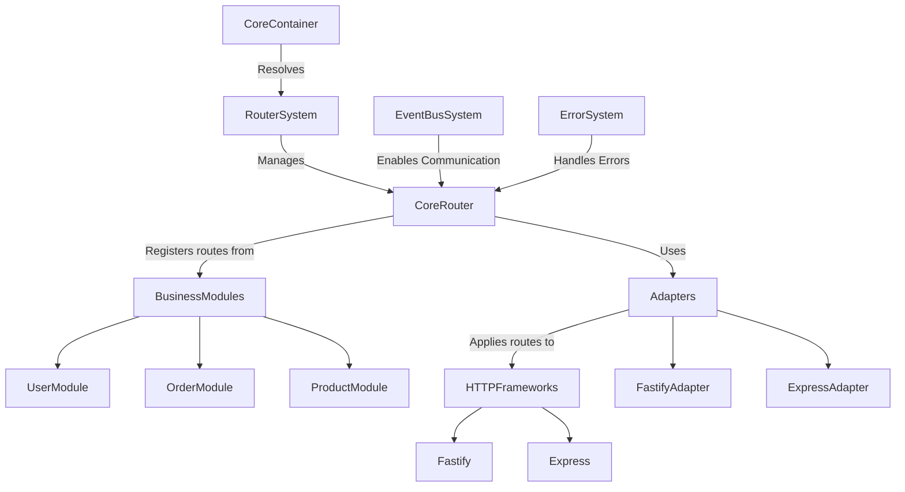

# Router System Documentation

## Table of Contents
1. [Overview](#overview)
2. [Purpose](#purpose)
3. [System Architecture](#system-architecture)
4. [Core Components](#core-components)
5. [Route Management](#route-management)
6. [Route Registration](#route-registration)
7. [Adapter Pattern](#adapter-pattern)
8. [Event System Integration](#event-system-integration)
9. [Error Handling](#error-handling)
10. [Module Integration](#module-integration)
11. [HTTP Framework Integration](#http-framework-integration)
12. [Health Monitoring](#health-monitoring)
13. [Testing Strategy](#testing-strategy)
14. [Best Practices](#best-practices)
15. [Extending the System](#extending-the-system)
16. [Areas for Improvement](#areas-for-improvement)

## Overview

The Router System provides a centralized mechanism for registering, managing, and applying HTTP routes across modules in a TSMIS Core application. It enables business modules to define routes without direct dependencies on HTTP frameworks, creating a clean separation between business logic and HTTP concerns.

## Purpose

The primary goals of the Router System are to:
- Provide a uniform route registration interface across the application
- Decouple business modules from specific HTTP frameworks
- Enable centralized route management, validation, and conflict detection
- Support framework-agnostic route definitions
- Facilitate automatic route discovery and registration from modules
- Enable clean separation between route definitions and HTTP server implementation
- Promote testability of route handlers independent of HTTP frameworks

## System Architecture

### High-Level Architecture



### System Flow

The Router System operates through the following flow:

1. **Module Route Definition**: Modules define routes during initialization
2. **Route Registration**: Routes are registered with the CoreRouter through the RouterSystem
3. **Conflict Detection**: CoreRouter detects and prevents route conflicts
4. **Adapter Selection**: Application selects appropriate framework adapter
5. **Route Application**: Adapter applies routes to HTTP framework
6. **Request Handling**: HTTP requests are routed to module handlers
7. **Response Processing**: Responses are returned through the HTTP framework

## Core Components

### CoreRouter

The `CoreRouter` class is responsible for managing routes and adapters:

```javascript
class CoreRouter extends EventEmitter {
  static dependencies = ['errorSystem', 'eventBusSystem', 'config'];
  static version = '1.0.0';

  constructor(deps) {
    super();
    this.deps = deps;
    this.routes = new Map();
    this.adapters = new Map();
    this.middleware = new Map();
    this.initialized = false;
    this.state = {
      status: 'created',
      startTime: null,
      errors: [],
      metrics: new Map(),
      healthChecks: new Map()
    };
  }

  // Key methods
  async initialize() { /* ... */ }
  registerRoute(moduleId, method, path, handler, options = {}) { /* ... */ }
  registerAdapter(name, adapter) { /* ... */ }
  async applyRoutes(framework, adapterName) { /* ... */ }
  getRoutes() { /* ... */ }
  async shutdown() { /* ... */ }
}
```

### RouterSystem

The `RouterSystem` class serves as a management layer for the CoreRouter:

```javascript
class RouterSystem {
  static dependencies = ['errorSystem', 'eventBusSystem', 'config'];

  constructor(deps) {
    this.deps = deps;
    this.router = null;
    this.initialized = false;
  }

  // Key methods
  async initialize() { /* ... */ }
  getRouter() { /* ... */ }
  registerRoute(moduleId, method, path, handler, options = {}) { /* ... */ }
  registerAdapter(name, adapter) { /* ... */ }
  async applyRoutes(framework, adapterName) { /* ... */ }
  getRoutes() { /* ... */ }
  async shutdown() { /* ... */ }
}
```

### RoutableModule

The `RoutableModule` class extends `CoreModule` to provide route registration capabilities:

```javascript
class RoutableModule extends CoreModule {
  constructor(deps) {
    super(deps);
    this.routes = [];
  }

  // Key methods
  registerRoute(method, path, handler, options = {}) { /* ... */ }
  registerVersionedRoute(version, method, path, handler, options = {}) { /* ... */ }
  async registerAllRoutes() { /* ... */ }
  async onInitialize() { /* ... */ }
  async unregisterRoute(method, path) { /* ... */ }
  async onShutdown() { /* ... */ }
}
```

### IRouterAdapter

The `IRouterAdapter` interface defines the contract for framework adapters:

```javascript
class IRouterAdapter {
  async applyRoutes(framework, routes) {
    throw new Error('applyRoutes() must be implemented');
  }
}
```

## Route Management

### Route Registration Process

The CoreRouter maintains a registry of all routes in the application:

```javascript
registerRoute(moduleId, method, path, handler, options = {}) {
  if (!this.initialized) {
    throw new RouterError(
      'NOT_INITIALIZED',
      'CoreRouter is not initialized'
    );
  }

  const routeKey = `${method.toUpperCase()}:${path}`;

  // Check for conflicts
  if (this.routes.has(routeKey)) {
    const existing = this.routes.get(routeKey);
    throw new RouterError(
      'ROUTE_CONFLICT',
      `Route conflict: ${routeKey} already registered by ${existing.moduleId}`,
      { existingRoute: existing, newRoute: { moduleId, method, path } }
    );
  }

  // Register the route
  this.routes.set(routeKey, {
    moduleId,
    method: method.toUpperCase(),
    path,
    handler,
    options
  });

  // Emit event
  this.emit('route:registered', {
    moduleId,
    method: method.toUpperCase(),
    path,
    timestamp: new Date().toISOString()
  });

  // Record metric
  this.recordMetric('routes.registered', 1, {
    moduleId,
    method: method.toUpperCase()
  });

  return this;
}
```

### Route Storage

Routes are stored with the following structure:

```javascript
// Route object structure
{
  moduleId: 'userModule',       // Module that registered the route
  method: 'GET',                // HTTP method
  path: '/api/users/:id',       // Route path
  handler: function() { ... },  // Route handler function
  options: {                    // Route-specific options
    schema: { ... },            // Validation schema
    auth: true,                 // Authentication required
    roles: ['admin', 'user'],   // Required roles
    tags: ['users', 'api']      // API documentation tags
  }
}
```

### Route Conflict Detection

The CoreRouter prevents route conflicts by checking for duplicate routes during registration:

```javascript
// Conflict detection in registerRoute method
if (this.routes.has(routeKey)) {
  const existing = this.routes.get(routeKey);
  throw new RouterError(
    'ROUTE_CONFLICT',
    `Route conflict: ${routeKey} already registered by ${existing.moduleId}`,
    { existingRoute: existing, newRoute: { moduleId, method, path } }
  );
}
```

## Route Registration

### Direct Registration

Routes can be registered directly with the RouterSystem:

```javascript
// In application bootstrap code
const routerSystem = await container.resolve('routerSystem');

routerSystem.registerRoute(
  'userModule',
  'GET',
  '/api/users',
  async (request, reply) => {
    const users = await userService.findAll();
    return users;
  },
  { auth: true }
);
```

### Module-Based Registration

More commonly, modules will register their own routes using the RoutableModule:

```javascript
// In a RoutableModule class
class UserModule extends RoutableModule {
  async onInitialize() {
    // Register routes
    this.registerRoute('GET', '/api/users', this.listUsers);
    this.registerRoute('GET', '/api/users/:id', this.getUserById);
    this.registerRoute('POST', '/api/users', this.createUser);
    
    await super.onInitialize();
  }
  
  async listUsers(request, reply) {
    // Handler implementation
  }
  
  async getUserById(request, reply) {
    // Handler implementation
  }
  
  async createUser(request, reply) {
    // Handler implementation
  }
}
```

### Event-Based Registration

Routes can also be registered via events:

```javascript
// Event-based registration
eventBus.emit('router.route.register', {
  moduleId: 'dynamicModule',
  method: 'GET',
  path: '/api/dynamic',
  handler: async (request, reply) => {
    return { message: 'Dynamic route' };
  },
  options: { auth: false }
});
```

## Adapter Pattern

### Adapter Interface

The Router System uses the adapter pattern to support different HTTP frameworks:

```javascript
// Interface for framework adapters
class IRouterAdapter {
  /**
   * Apply routes to a framework
   * @param {Object} framework - HTTP framework instance
   * @param {Array} routes - Array of route objects
   * @returns {Promise<Object>} - Framework instance with routes applied
   */
  async applyRoutes(framework, routes) {
    throw new Error('applyRoutes() must be implemented');
  }
}
```

### Framework Adapters

Specific adapters implement the interface for different frameworks:

```javascript
// Fastify adapter
class FastifyAdapter extends IRouterAdapter {
  async applyRoutes(fastify, routes) {
    for (const route of routes) {
      const { method, path, handler, options } = route;
      
      fastify.route({
        method,
        url: path,
        handler,
        schema: options.schema,
        ...options.fastify
      });
    }
    
    return fastify;
  }
}

// Express adapter
class ExpressAdapter extends IRouterAdapter {
  async applyRoutes(app, routes) {
    for (const route of routes) {
      const { method, path, handler, options } = route;
      
      const middleware = options.middleware || [];
      app[method.toLowerCase()](path, ...middleware, this.wrapHandler(handler));
    }
    
    return app;
  }
  
  // Helper to adapt handler for Express
  wrapHandler(handler) {
    return async (req, res, next) => {
      try {
        const result = await handler(req, res);
        if (!res.headersSent) {
          res.json(result);
        }
      } catch (error) {
        next(error);
      }
    };
  }
}
```

### Adapter Registration and Usage

Adapters are registered with the RouterSystem and used to apply routes:

```javascript
// Register adapter
routerSystem.registerAdapter('fastify', new FastifyAdapter());
routerSystem.registerAdapter('express', new ExpressAdapter());

// Apply routes to framework
const fastify = Fastify();
await routerSystem.applyRoutes(fastify, 'fastify');

// Start server
await fastify.listen({ port: 3000 });
```

## Event System Integration

The Router System integrates with the EventBusSystem for route registration and lifecycle events:

### Event Subscriptions

```javascript
async initialize() {
  // ... other initialization code
  
  // Subscribe to events
  const eventBus = this.deps.eventBusSystem.getEventBus();
  
  this.subscriptions = [
    eventBus.subscribe('router.route.register', this.handleRouteRegistration.bind(this)),
    eventBus.subscribe('router.routes.clear', this.handleRoutesClear.bind(this)),
    eventBus.subscribe('router.module.unregister', this.handleModuleUnregister.bind(this))
  ];
  
  // ... more initialization code
}
```

### Event Emissions

```javascript
// Emit events from CoreRouter
this.emit('route:registered', {
  moduleId,
  method: method.toUpperCase(),
  path,
  timestamp: new Date().toISOString()
});

this.emit('routes:applied', {
  adapter: adapterName,
  count: routes.length,
  timestamp: new Date().toISOString()
});
```

### Event Handling

```javascript
// Handle route registration events
async handleRouteRegistration(event) {
  try {
    const { moduleId, method, path, handler, options } = event.data;
    this.registerRoute(moduleId, method, path, handler, options);
  } catch (error) {
    await this.handleError(error, {
      event,
      handler: 'handleRouteRegistration'
    });
  }
}
```

## Error Handling

### RouterError Type

The Router System uses a specialized error type defined in the errors system:

```javascript
// src/core/errors/types/RouterError.js
import { CoreError } from '../Error.js';

/**
 * Router system related errors
 * @extends CoreError
 */
export class RouterError extends CoreError {
  /**
   * Create a new RouterError
   * @param {string} code - Error code
   * @param {string} message - Error message
   * @param {Object} [details={}] - Additional error details
   * @param {Object} [options={}] - Error options
   */
  constructor(code, message, details = {}, options = {}) {
    super(`ROUTER_${code}`, message, details, options);
    this.statusCode = 500;
  }
}
```

### Error Codes

```javascript
// Router error codes
export const RouterErrorCodes = {
  INITIALIZATION_FAILED: 'INITIALIZATION_FAILED',
  ALREADY_INITIALIZED: 'ALREADY_INITIALIZED',
  NOT_INITIALIZED: 'NOT_INITIALIZED',
  ROUTE_CONFLICT: 'ROUTE_CONFLICT',
  INVALID_ROUTE: 'INVALID_ROUTE',
  INVALID_MODULE_ID: 'INVALID_MODULE_ID',
  INVALID_METHOD: 'INVALID_METHOD',
  INVALID_PATH: 'INVALID_PATH',
  INVALID_HANDLER: 'INVALID_HANDLER',
  INVALID_MIDDLEWARE: 'INVALID_MIDDLEWARE',
  ADAPTER_NOT_FOUND: 'ADAPTER_NOT_FOUND',
  INVALID_ADAPTER: 'INVALID_ADAPTER',
  ROUTE_REGISTRATION_FAILED: 'ROUTE_REGISTRATION_FAILED',
  ROUTES_APPLICATION_FAILED: 'ROUTES_APPLICATION_FAILED',
  SHUTDOWN_FAILED: 'SHUTDOWN_FAILED'
};
```

### Error Handling

The CoreRouter includes comprehensive error handling:

```javascript
async handleError(error, context = {}) {
  // Add error to state
  this.state.errors.push({
    timestamp: new Date().toISOString(),
    error: error.message,
    context: context || {}
  });
  
  // Trim error history
  if (this.state.errors.length > 100) {
    this.state.errors.shift();
  }
  
  // Record metric
  this.recordMetric('router.errors', 1, {
    errorType: error.constructor.name,
    errorCode: error.code
  });
  
  // Forward to error system
  if (this.deps.errorSystem) {
    try {
      await this.deps.errorSystem.handleError(error, {
        source: 'CoreRouter',
        ...context
      });
    } catch (handlerError) {
      // Log error handling failure
      this.state.errors.push({
        timestamp: new Date().toISOString(),
        error: handlerError.message,
        context: { phase: 'error-handling' }
      });
    }
  }
  
  // Emit error event
  this.emit('router:error', {
    error,
    context,
    timestamp: new Date().toISOString()
  });
}
```

## Module Integration

### RoutableModule

The `RoutableModule` class extends `CoreModule` to provide route registration capabilities:

```javascript
import { CoreModule } from '../module/Module.js';
import { RouterError } from '../errors/types/RouterError.js';

export class RoutableModule extends CoreModule {
  constructor(deps) {
    super(deps);
    this.routes = [];
  }
  
  /**
   * Register a route with the router system
   */
  registerRoute(method, path, handler, options = {}) {
    // Store route for later registration
    this.routes.push({
      method: method.toUpperCase(),
      path,
      handler: handler.bind(this), // Bind to module instance
      options
    });
    
    // If we're already initialized, register immediately
    if (this.initialized) {
      this.registerRouteImmediately(method, path, handler, options);
    }
    
    return this;
  }
  
  /**
   * Immediately register a route with the router system
   */
  async registerRouteImmediately(method, path, handler, options = {}) {
    const eventBus = this.deps.eventBusSystem.getEventBus();
    
    await eventBus.emit('router.route.register', {
      moduleId: this.constructor.name,
      method: method.toUpperCase(),
      path,
      handler: handler.bind(this),
      options
    });
  }
  
  /**
   * Register all routes with the router system
   */
  async registerAllRoutes() {
    const eventBus = this.deps.eventBusSystem.getEventBus();
    
    for (const route of this.routes) {
      const { method, path, handler, options } = route;
      
      await eventBus.emit('router.route.register', {
        moduleId: this.constructor.name,
        method,
        path,
        handler,
        options
      });
    }
  }
  
  /**
   * Hook into initialization to register routes
   */
  async onInitialize() {
    await this.registerAllRoutes();
    await super.onInitialize();
  }
}
```

### Using RoutableModule

```javascript
import { RoutableModule } from '@core/router';

export class UserModule extends RoutableModule {
  static dependencies = ['database', 'errorSystem', 'eventBusSystem'];
  
  constructor(deps) {
    super(deps);
    this.database = deps.database;
  }
  
  async onInitialize() {
    // Register routes
    this.registerRoute('GET', '/api/users', this.listUsers);
    this.registerRoute('GET', '/api/users/:id', this.getUserById);
    this.registerRoute('POST', '/api/users', this.createUser);
    
    await super.onInitialize();
  }
  
  // Business methods
  async findAllUsers() {
    return this.database.users.findAll();
  }
  
  async findUserById(id) {
    return this.database.users.findById(id);
  }
  
  async createUserInDb(userData) {
    const user = await this.database.users.create(userData);
    await this.emit('user.created', user);
    return user;
  }
  
  // Route handlers
  async listUsers(request, reply) {
    try {
      const users = await this.findAllUsers();
      return users;
    } catch (error) {
      await this.handleError(error, { 
        method: 'listUsers',
        request: { query: request.query }
      });
      throw error;
    }
  }
  
  async getUserById(request, reply) {
    const { id } = request.params;
    return this.findUserById(id);
  }
  
  async createUser(request, reply) {
    const userData = request.body;
    const user = await this.createUserInDb(userData);
    reply.code(201);
    return user;
  }
}
```

## HTTP Framework Integration

### Fastify Integration

```javascript
import Fastify from 'fastify';
import { FastifyAdapter } from '@core/router/integrations/fastify';

// Create Fastify instance
const fastify = Fastify({
  logger: true
});

// Get router system
const routerSystem = await container.resolve('routerSystem');

// Register the Fastify adapter
routerSystem.registerAdapter('fastify', new FastifyAdapter());

// Apply routes to Fastify
await routerSystem.applyRoutes(fastify, 'fastify');

// Start the server
await fastify.listen({ port: 3000 });
```

### Express Integration

```javascript
import express from 'express';
import { ExpressAdapter } from '@core/router/integrations/express';

// Create Express app
const app = express();

// Parse JSON bodies
app.use(express.json());

// Get router system
const routerSystem = await container.resolve('routerSystem');

// Register the Express adapter
routerSystem.registerAdapter('express', new ExpressAdapter());

// Apply routes to Express
await routerSystem.applyRoutes(app, 'express');

// Start the server
app.listen(3000, () => {
  console.log('Express server listening on port 3000');
});
```

## Health Monitoring

### Health Check Registration

The CoreRouter includes health monitoring capabilities:

```javascript
async setupDefaultHealthChecks() {
  // Register default health checks
  this.registerHealthCheck('state', async () => {
    return {
      status: this.initialized ? 'healthy' : 'unhealthy',
      uptime: this.state.startTime ? Date.now() - this.state.startTime : 0,
      errorCount: this.state.errors.length
    };
  });
  
  // Register routes health check
  this.registerHealthCheck('routes', async () => {
    const routes = Array.from(this.routes.values());
    const routesByMethod = {};
    
    for (const route of routes) {
      routesByMethod[route.method] = (routesByMethod[route.method] || 0) + 1;
    }
    
    return {
      status: 'healthy',
      count: routes.length,
      byMethod: routesByMethod
    };
  });
  
  // Register adapters health check
  this.registerHealthCheck('adapters', async () => {
    return {
      status: 'healthy',
      count: this.adapters.size,
      adapters: Array.from(this.adapters.keys())
    };
  });
}
```

### Health Check Execution

```javascript
async checkHealth() {
  const results = {};
  let overallStatus = 'healthy';
  
  for (const [name, checkFn] of this.state.healthChecks) {
    try {
      results[name] = await checkFn();
      if (results[name].status !== 'healthy') {
        overallStatus = 'unhealthy';
      }
    } catch (error) {
      results[name] = {
        status: 'error',
        error: error.message
      };
      overallStatus = 'unhealthy';
    }
  }
  
  return {
    name: 'CoreRouter',
    version: CoreRouter.version,
    status: overallStatus,
    timestamp: new Date().toISOString(),
    checks: results
  };
}
```

## Testing Strategy

### Testing CoreRouter

```javascript
describe('CoreRouter', () => {
  let router;
  let mockErrorSystem;
  let mockEventBus;
  
  beforeEach(() => {
    // Create mock dependencies
    mockErrorSystem = {
      handleError: jest.fn()
    };
    
    mockEventBus = {
      emit: jest.fn(),
      subscribe: jest.fn().mockReturnValue('sub-id')
    };
    
    const mockEventBusSystem = {
      getEventBus: () => mockEventBus
    };
    
    // Create CoreRouter instance
    router = new CoreRouter({
      errorSystem: mockErrorSystem,
      eventBusSystem: mockEventBusSystem,
      config: {}
    });
  });
  
  afterEach(async () => {
    // Clean up
    if (router.initialized) {
      await router.shutdown();
    }
  });
  
  test('should initialize correctly', async () => {
    await router.initialize();
    
    expect(router.initialized).toBe(true);
    expect(router.state.status).toBe('running');
    expect(mockEventBus.subscribe).toHaveBeenCalledWith(
      'router.route.register', 
      expect.any(Function)
    );
  });
  
  test('should register routes', async () => {
    await router.initialize();
    
    const handler = jest.fn();
    router.registerRoute('testModule', 'GET', '/test', handler);
    
    const routes = router.getRoutes();
    expect(routes).toHaveLength(1);
    expect(routes[0].moduleId).toBe('testModule');
    expect(routes[0].method).toBe('GET');
    expect(routes[0].path).toBe('/test');
    expect(routes[0].handler).toBe(handler);
  });
  
  test('should detect route conflicts', async () => {
    await router.initialize();
    
    router.registerRoute('moduleA', 'GET', '/test', () => {});
    
    expect(() => {
      router.registerRoute('moduleB', 'GET', '/test', () => {});
    }).toThrow(/Route conflict/);
  });
  
  test('should apply routes to framework', async () => {
    await router.initialize();
    
    // Register a route
    const handler = jest.fn();
    router.registerRoute('testModule', 'GET', '/test', handler);
    
    // Create a mock adapter
    const mockAdapter = {
      applyRoutes: jest.fn().mockResolvedValue({})
    };
    
    // Register the adapter
    router.registerAdapter('mock', mockAdapter);
    
    // Apply routes
    const mockFramework = {};
    await router.applyRoutes(mockFramework, 'mock');
    
    // Verify adapter was called
    expect(mockAdapter.applyRoutes).toHaveBeenCalledWith(
      mockFramework, 
      expect.arrayContaining([
        expect.objectContaining({
          method: 'GET',
          path: '/test',
          handler
        })
      ])
    );
  });
});
```

### Testing RouterSystem

```javascript
describe('RouterSystem', () => {
  let routerSystem;
  let mockErrorSystem;
  
  beforeEach(() => {
    // Create mock dependencies
    mockErrorSystem = {
      handleError: jest.fn()
    };
    
    // Create RouterSystem instance
    routerSystem = new RouterSystem({
      errorSystem: mockErrorSystem,
      eventBusSystem: { getEventBus: jest.fn() },
      config: {}
    });
  });
  
  afterEach(async () => {
    // Clean up
    if (routerSystem.initialized) {
      await routerSystem.shutdown();
    }
  });
  
  test('should initialize and create CoreRouter', async () => {
    await routerSystem.initialize();
    
    expect(routerSystem.initialized).toBe(true);
    expect(routerSystem.router).toBeInstanceOf(CoreRouter);
  });
  
  test('should delegate route registration to CoreRouter', async () => {
    await routerSystem.initialize();
    
    // Mock the CoreRouter method
    routerSystem.router.registerRoute = jest.fn();
    
    // Call RouterSystem method
    const handler = jest.fn();
    routerSystem.registerRoute('moduleA', 'GET', '/test', handler);
    
    // Verify delegation
    expect(routerSystem.router.registerRoute).toHaveBeenCalledWith(
      'moduleA', 'GET', '/test', handler, {}
    );
  });
});
```

### Testing RoutableModule

```javascript
describe('RoutableModule', () => {
  let module;
  let mockEventBus;
  
  beforeEach(() => {
    // Create mock dependencies
    mockEventBus = {
      emit: jest.fn(),
      subscribe: jest.fn().mockReturnValue('sub-id')
    };
    
    const mockEventBusSystem = {
      getEventBus: () => mockEventBus
    };
    
    // Create RoutableModule instance
    class TestModule extends RoutableModule {
      async testHandler() {
        return { success: true };
      }
    }
    
    module = new TestModule({
      eventBusSystem: mockEventBusSystem,
      errorSystem: { handleError: jest.fn() }
    });
  });
  
  test('should register routes during initialization', async () => {
    // Register a route
    module.registerRoute('GET', '/test', module.testHandler);
    
    // Initialize module
    await module.initialize();
    
    // Verify event was emitted
    expect(mockEventBus.emit).toHaveBeenCalledWith(
      'router.route.register',
      expect.objectContaining({
        moduleId: 'TestModule',
        method: 'GET',
        path: '/test'
      })
    );
  });
  
  test('should register routes immediately when already initialized', async () => {
    // Initialize module
    await module.initialize();
    
    // Clear previous calls
    mockEventBus.emit.mockClear();
    
    // Register a route
    module.registerRoute('GET', '/test', module.testHandler);
    
    // Verify event was emitted immediately
    expect(mockEventBus.emit).toHaveBeenCalledWith(
      'router.route.register',
      expect.objectContaining({
        moduleId: 'TestModule',
        method: 'GET',
        path: '/test'
      })
    );
  });
});
```

## Best Practices

### 1. Module-Based Route Organization

Organize routes by business module rather than by technical concerns:

```javascript
class UserModule extends RoutableModule {
  async onInitialize() {
    // User management routes
    this.registerRoute('GET', '/api/users', this.listUsers);
    this.registerRoute('POST', '/api/users', this.createUser);
    
    // User profile routes
    this.registerRoute('GET', '/api/users/:id/profile', this.getUserProfile);
    this.registerRoute('PUT', '/api/users/:id/profile', this.updateUserProfile);
    
    // User authentication routes
    this.registerRoute('POST', '/api/users/login', this.loginUser);
    this.registerRoute('POST', '/api/users/logout', this.logoutUser);
    
    await super.onInitialize();
  }
}
```

### 2. Consistent Route Naming

Follow consistent route naming conventions:

```javascript
// Good - RESTful resource pattern
this.registerRoute('GET', '/api/users', this.listUsers);
this.registerRoute('GET', '/api/users/:id', this.getUserById);
this.registerRoute('POST', '/api/users', this.createUser);
this.registerRoute('PUT', '/api/users/:id', this.updateUser);
this.registerRoute('DELETE', '/api/users/:id', this.deleteUser);

// Good - Action-based pattern for non-CRUD operations
this.registerRoute('POST', '/api/users/:id/activate', this.activateUser);
this.registerRoute('POST', '/api/users/:id/deactivate', this.deactivateUser);

// Bad - Inconsistent patterns
this.registerRoute('GET', '/api/getUsers', this.getUsers);
this.registerRoute('POST', '/api/createUser', this.createUser);
```

### 3. Separate Route Handlers from Business Logic

Keep route handlers thin and delegate to business methods:

```javascript
// Route handler - concerned with HTTP
async createUser(request, reply) {
  try {
    // Validate input
    const userData = request.body;
    
    // Delegate to business method
    const user = await this.createUserInDb(userData);
    
    // Set HTTP response
    reply.code(201);
    return user;
  } catch (error) {
    // Handle HTTP-specific error
    await this.handleError(error, { 
      method: 'createUser',
      userData: request.body
    });
    throw error;
  }
}

// Business method - pure business logic
async createUserInDb(userData) {
  // Business validations
  if (!userData.email) {
    throw new ValidationError('MISSING_EMAIL', 'Email is required');
  }
  
  // Core business logic
  const user = await this.database.users.create(userData);
  
  // Business events
  await this.emit('user.created', user);
  
  return user;
}
```

### 4. Consistent Error Handling

Handle errors consistently in route handlers:

```javascript
async updateUser(request, reply) {
  try {
    const { id } = request.params;
    const userData = request.body;
    
    const user = await this.updateUserInDb(id, userData);
    return user;
  } catch (error) {
    if (error instanceof ValidationError) {
      // Convert validation errors to 400 Bad Request
      reply.code(400);
      return { 
        error: error.message,
        validationErrors: error.validationErrors
      };
    }
    
    if (error instanceof NotFoundError) {
      // Convert not found errors to 404 Not Found
      reply.code(404);
      return { error: error.message };
    }
    
    // Log all errors
    await this.handleError(error, {
      method: 'updateUser',
      userId: id,
      userData
    });
    
    // Let the framework handle other errors
    throw error;
  }
}
```

### 5. Use Route Options for Metadata

Use route options to store metadata about routes:

```javascript
this.registerRoute('GET', '/api/users', this.listUsers, {
  auth: true,                 // Requires authentication
  roles: ['admin', 'user'],   // Required roles
  rateLimit: {                // Rate limiting
    limit: 100,
    period: 60000  // 1 minute
  },
  cache: {                    // Response caching
    ttl: 30000,    // 30 seconds
    scope: 'public'
  },
  tags: ['users', 'api'],     // API documentation tags
  description: 'List all users', // API documentation
  schema: {                   // Request/response validation
    query: { /* validation schema */ },
    response: { /* validation schema */ }
  }
});
```

## Extending the System

### 1. Middleware Support

The Router System already includes middleware support:

```javascript
// Register global middleware
routerSystem.registerMiddleware('auth', async (request, reply, next) => {
  if (!request.headers.authorization) {
    throw new AuthError('UNAUTHORIZED', 'Authentication required');
  }
  await next();
}, { order: 10 });

// Use middleware with routes
this.registerRoute('GET', '/api/users', this.listUsers, {
  middleware: ['auth', 'metrics']
});
```

The RouterSystem handles middleware application through adapters:

```javascript
getMiddlewareForRoute(route) {
  const routeMiddleware = route.options.middleware || [];
  const middleware = [];
  
  // Add global middleware
  for (const [name, mid] of this.middleware) {
    if (this.shouldApplyMiddleware(name, mid, route)) {
      middleware.push({
        name,
        handler: mid.handler,
        order: mid.order
      });
    }
  }
  
  // Add route-specific middleware
  for (const name of routeMiddleware) {
    if (this.middleware.has(name)) {
      const mid = this.middleware.get(name);
      middleware.push({
        name,
        handler: mid.handler,
        order: mid.order
      });
    }
  }
  
  // Sort by order
  return middleware.sort((a, b) => a.order - b.order);
}
```

### 2. Versioned Routes

Support for API versioning is built into the system:

```javascript
// In RouterSystem
registerVersionedRoute(moduleId, version, method, path, handler, options = {}) {
  const versionedPath = `/api/v${version}${path.startsWith('/') ? path : `/${path}`}`;
  return this.registerRoute(moduleId, method, versionedPath, handler, {
    ...options,
    version
  });
}

// In RoutableModule
registerVersionedRoute(version, method, path, handler, options = {}) {
  const versionedPath = `/api/v${version}${path.startsWith('/') ? path : `/${path}`}`;
  return this.registerRoute(method, versionedPath, handler, {
    ...options,
    version
  });
}

// Usage in module
class UserModule extends RoutableModule {
  async onInitialize() {
    // Version 1 routes
    this.registerVersionedRoute(1, 'GET', '/users', this.listUsersV1);
    
    // Version 2 routes with enhanced functionality
    this.registerVersionedRoute(2, 'GET', '/users', this.listUsersV2, {
      schema: { /* enhanced schema */ }
    });
    
    await super.onInitialize();
  }
}
```

### 3. Route Documentation

Generate API documentation from route metadata:

```javascript
// Generate OpenAPI documentation
const openApiDoc = routerSystem.generateOpenApiDoc({
  title: 'API Documentation',
  version: '1.0.0',
  description: 'My API Documentation'
});

// Use documentation
app.get('/api/docs/json', (req, res) => {
  res.json(openApiDoc);
});
```

The documentation generation function is provided in the CoreRouter:

```javascript
generateOpenApiDoc(info = {}) {
  const paths = {};
  const tags = new Set();
  
  // Process routes
  for (const route of this.getRoutes()) {
    const { method, path, options } = route;
    
    // Extract tags
    if (options.tags) {
      for (const tag of options.tags) {
        tags.add(tag);
      }
    }
    
    // Process path parameters
    const pathParams = [];
    const openApiPath = path.replace(/:([^/]+)/g, (_, paramName) => {
      pathParams.push({
        name: paramName,
        in: 'path',
        required: true,
        schema: { type: 'string' }
      });
      return `{${paramName}}`;
    });
    
    // Build path object
    if (!paths[openApiPath]) {
      paths[openApiPath] = {};
    }
    
    // Build operation object
    paths[openApiPath][method.toLowerCase()] = {
      tags: options.tags || [],
      summary: options.summary || '',
      description: options.description || '',
      parameters: [
        ...pathParams,
        // Other parameters from options.schema
      ],
      responses: {
        // Response definitions from options.schema
      },
      security: options.auth ? [{ bearerAuth: [] }] : []
    };
  }
  
  // Build OpenAPI document
  return {
    openapi: '3.0.0',
    info: {
      title: info.title || 'API Documentation',
      version: info.version || '1.0.0',
      description: info.description || ''
    },
    tags: Array.from(tags).map(tag => ({ name: tag })),
    paths,
    components: {
      // Schema components
      securitySchemes: {
        bearerAuth: {
          type: 'http',
          scheme: 'bearer',
          bearerFormat: 'JWT'
        }
      }
    }
  };
}
```

## Areas for Improvement

1. **Advanced Route Matching**:
   - Support for regex-based route patterns
   - More sophisticated path matching algorithms
   - Query parameter constraints
   - Content negotiation based on Accept headers

2. **Dynamic Routing**:
   - Runtime route registration and unregistration
   - Route prioritization and weight-based routing
   - Conditional routes based on feature flags
   - A/B testing support for routes

3. **Enhanced Validation**:
   - Integrated schema validation for request/response
   - Custom validators for specific route parameters
   - Pre-processing and transformation of request data
   - Structured error responses for validation failures

4. **Performance Optimization**:
   - Route caching for faster lookups
   - Optimized path matching algorithms
   - Request/response compression middleware
   - Response streaming for large payloads

5. **Security Enhancements**:
   - Built-in CSRF protection
   - Rate limiting middleware
   - Request sanitization
   - API key management
   - IP filtering

6. **Observability**:
   - Per-route metrics collection
   - Request tracing and correlation IDs
   - Performance monitoring
   - Traffic analysis

7. **Framework Independence**:
   - More framework adapters (Koa, Hapi, etc.)
   - Framework-agnostic middleware
   - Pluggable HTTP parser/serializer
   - WebSocket support

8. **Developer Experience**:
   - Route grouping and organization
   - Route introspection and debugging tools
   - Hot reloading of routes during development
   - Documentation generation from route metadata